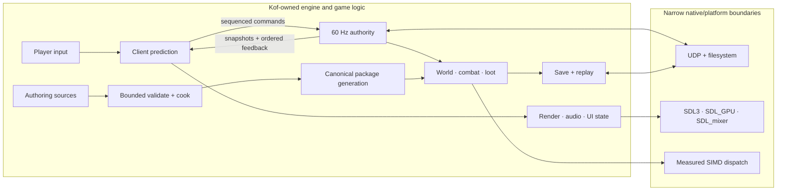

<p align="center">
  
</p>

<p align="center">
  <a href="https://github.com/rufl/KOOKIE/actions/workflows/verify.yml"></a>
  <a href="https://github.com/rufl/KOOKIE/releases"></a>
  
  <a href="LICENSE"></a>
  
</p>

<p align="center">
  <strong>An experimental 3D shooter engine built around Kof.</strong><br>
  Boomer-shooter combat, ARPG structure, authoritative multiplayer and a
  fail-closed content pipeline—without a general-purpose engine behind it.
</p>

<p align="center">
  <a href="#quick-start">Quick start</a> ·
  <a href="#the-shape-of-the-engine">Architecture</a> ·
  <a href="https://github.com/rufl/KOOKIE/releases">Dogfood releases</a> ·
  <a href="docs/RUNNING_AND_PACKAGING.md">Build and package</a> ·
  <a href="pt-BR/README.md">Português (Brasil)</a>
</p>

> **Experimental, deliberately.** KOOKIE is an engine lab, not a finished game
> or a general-purpose engine. Claims below are limited to the focused probes,
> hardware and workloads that produced them.

## Start here

| If you want to… | Go here |
|---|---|
| Run the current authoritative check | [Quick start](#quick-start) |
| Download the latest public Linux artifact | [Releases](https://github.com/rufl/KOOKIE/releases) |
| Try the current lobby and player screen | [Multiplayer lobby and score screen](#multiplayer-lobby-and-score-screen) |
| Assess Windows/Linux playable-demo readiness | [Demo release readiness](docs/DEMO_RELEASE.md) |
| Understand the boundaries | [Architecture](docs/ARCHITECTURE.md) |
| Build, package or run qualification roles | [Running and packaging](docs/RUNNING_AND_PACKAGING.md) |
| See the evidence and open work | [Engine plan](docs/ENGINE_PLAN.md) and [G0 backlog](docs/G0_BACKLOG.md) |
| Change the project | [Contributing](CONTRIBUTING.md) |

## Why this exists

Most engines optimize for broad applicability. KOOKIE optimizes for inspectable
authority boundaries and claims that can be reproduced.

Portable engine, game and tool decisions stay in Kof. C owns narrow,
explicit platform boundaries: SDL3/SDL_GPU, SDL_mixer, UDP, filesystem
durability and measured SIMD dispatch. A feature is not called done because a
class or menu exists; it needs an executable path and a stated proof limit.

The result is intentionally opinionated:

- the server decides combat, loot, progression and persistence;
- clients predict presentation-safe movement, then reconcile;
- source assets cross bounded validation and canonicalization before runtime;
- malformed state, packages, saves and compatibility offers fail closed;
- release artifacts bind source and toolchain provenance with signatures.

## Quick start

### Play the published package

The signed Linux dogfood archive already contains the native Kof game, SDL3,
SDL_mixer and its launcher. Running the packaged game requires neither the Kof
toolchain nor Python:

1. Download [`0.1.0-dogfood.34`](https://github.com/rufl/KOOKIE/releases/tag/0.1.0-dogfood.34).
2. Verify `SHA256SUMS` and the detached signatures as described in
   [Running and packaging](docs/RUNNING_AND_PACKAGING.md#run-the-currently-published-linux-dogfood).
3. Extract the archive and run:

```bash
./kookie
```

The current public release is Linux-only. A current Windows demo archive is
not published yet; a Windows package will launch through `kookie.exe` and will
also be self-contained.

### Run qualification from source

Install [Kof 0.5.0-beta](https://github.com/KofLang/Kof4j) for the source
entrypoint:

```bash
git clone https://github.com/rufl/KOOKIE.git
cd KOOKIE
kof run src/main.kf --target native
```

`kof run` itself does not require Python. Python 3 is currently required by
repository verification, packaging, evidence-validation and rendezvous scripts
such as `scripts/verify.sh`, `scripts/package_kookie.sh` and
`scripts/kookie_rendezvous.py`.

Run the focused gameplay and replay path:

```bash
bash scripts/verify_interactions.sh
```

Run the focused local goose gameplay and multiplayer lobby/score probes:

```bash
bash scripts/verify_goose_game.sh
bash scripts/verify_multiplayer_ui.sh
```

Run the non-graphical G6 expansion probes:

```bash
bash scripts/verify_g6_runtime.sh
```

Presentation package builds additionally require SDL 3.4.16, SDL_mixer 3.2.4
and `glslc`. Exact package, kooker, Windows and cross-host qualification
commands live in [Running and packaging](docs/RUNNING_AND_PACKAGING.md).

An auto-installing, self-updating launcher is not published yet. It should be
a separate developer/player bootstrap product: the player package must remain
self-contained, while Kof installation and stable/beta/alpha/canary channel
updates must use signed manifests, pinned artifacts and atomic rollback.

## Multiplayer lobby and score screen

The Kof-owned multiplayer screen keeps the session contract small and
inspectable: fixed two-player admission, host/join/waiting/connected/ready/
failed phases, room identity, bounded player names, peer count, ping display
and visible transport errors. It is a session card, not an unbounded
master-server browser. Gameplay remains locked while either player is not
ready; the `READY` action is explicit and the session opens only after both
connected players confirm.

During gameplay, `Tab` toggles a deterministic player screen with player name,
score, health, kills/deaths, ping and live/ready/disconnected status. The host
publishes a checksummed bounded scoreboard snapshot; clients validate the
whole message, reject stale sequences and rank ties by score, kills, deaths
and stable player ID. A displayed `--` ping means RTT measurement is not yet
available; it is not a fabricated latency value.

The focused model and staging proof is:

```bash
bash scripts/verify_multiplayer_ui.sh
```


## Current demo and release status

The latest public artifact is
[`0.1.0-dogfood.34`](https://github.com/rufl/KOOKIE/releases/tag/0.1.0-dogfood.34):
signed Linux x86-64 SDL presentation, built from source commit
`4fdc25d7ed377c72cdcb7cf0f4ed35ea992cc947`. It predates the current source
presentation path, fixed-tick netcode, multiplayer lobby/score screen, native
Windows PE/SDL qualification and CI-gate changes. It is dogfood presentation,
not the current playable-demo package.

The current source tree has a bounded player-facing slice:

The player-facing test game is branded **GatoGanso**. Its bounded native
presentation uses bundled `Jared Lite` body text and `Pixand` display text;
the original TTF files and SIL Open Font License notice remain in
`assets/fonts`.

- `Play` starts the local authoritative listen-server/client encounter,
  accepts keyboard and mouse input, runs three goose bots and resets when
  leaving and entering `Play` again.
- `Multiplayer > Host/Join` admits the second player through the KOF-owned
  lobby, requires both connected players to select `READY`, and publishes the
  deterministic `Tab` scoreboard with player, status, score, HP, K/D and ping.
- The session path uses fixed-tick input bundles with snapshot/input ACKs,
  authenticated peer pinning, a bounded 12-tick hitscan rewind window, six-tick
  remote interpolation and prediction-correction metrics. The WAN path remains
  best-effort direct IPv4/UDP rather than a QUIC-compatible or production
  relay service.
The 2026-10-02 GUI pass adds a consistent framed shell, selected-row rails,
screen-specific subtitles, bounded text clipping and explicit keyboard hints
across the main, options, multiplayer and Kutter screens. The focused
`bash scripts/verify_multiplayer_ui.sh` probe now stages all four screens in
both JVM and native paths; `bash scripts/verify_goose_game.sh` also passes.
The focused dedicated-server gate also passes 512 measured ticks at p95
`3.624ms` (p99 `3.689ms`, maximum `3.899ms`) under the declared 4ms
simulation budget.


Same-tick authoritative revisions are ordered by state sequence: a newer
sequence replaces the latest sample for lifecycle or stale-command diagnostics,
while older ticks and sequences remain rejected. Restoring a replay checkpoint
starts a fresh rewind-history epoch before fixed-tick advancement resumes.

The 2026-10-02 local Linux clean-tree qualification built the deterministic
signed `0.1.0-linux-e2e.1` package from source commit
`1678a7de671866d94080718c367ab05875a92c2d`, verified signatures/checksums,
safe extraction and package smoke outside the checkout, and passed
`scripts/verify_goose_game.sh`. It used a temporary local Ed25519 key and a
pinned SDL_mixer 3.2.4 prefix, so it is not a public release identity. The
isolated presentation smoke reported `No DRI3 support detected` and
`No supported SDL_GPU backend found` before timeout 124; supported Linux
hardware evidence remains open.

The 2026-10-02 qualification batch also passed the signed Windows native
PE/SDL presentation artifact gate with pinned MinGW SDL3/SDL_mixer and DXC.
A clean detached-worktree builder run produced
`0.1.0-windows-e2e.1` from source commit
`1678a7de671866d94080718c367ab05875a92c2d` with Kof source commit
`bf17ac7e736471c8a04b4153e5b0f607be75e70c`; its archive SHA-256 is
`c8153ae34b2a1ea7f8c85411df95393c02573fc433a477c539153459975e80a4`.
Outside-checkout verification passed deterministic duplicate builds,
signatures/checksums, safe ZIP extraction, PE `MZ` validation and the
SPIR-V/DXIL package entries. The qualification key was temporary, so it is not
a public release artifact. An isolated Wine presentation smoke reached native
SDL but exited 70 with `kookie_gpu_open: No supported SDL_GPU backend found!`;
native Windows hardware evidence remains open.
The current GUI qualification artifact is
`0.1.0-gui.1`, built from source commit
`b1d4db92bf3adf166d503ca0eb44d8569498950c`, with archive SHA-256
`d9b909a4270fc9ca8fbd46a63bd0a21bc646e819da2ae6c3f89fa143dc1da902`.
Deterministic signing, extraction and package smoke passed. It uses an
ephemeral key and is not a public release. An earlier overzeer attempt was
blocked by full I/O pressure; a retry reached native SDL but reported
`No DRI3 support detected` and `No supported SDL_GPU backend found` before
the 240-second timeout, so no target-hardware GPU claim is made.

The current source commit
`87d3bc63b3bbc66c23f796258f5b9ea5147fb0df` also produced local native package
`0.1.0-perf.2`; its archive SHA-256 is
`3d40aa2c012e610c460379c5ca0c62ecf0cc30b6bba57165bfe45c2dee8c8014`.
Extracted package smoke passed, and the packaged dedicated server passed the
4ms p95 gate (`3396us` in the retained run). This is a local qualification
package, not a public release.


The deterministic clean-tree builder now passes locally for both Linux and
Windows; the public package, target-specific presentation evidence and paired
release still need to be refreshed.

| Target | Current source/evidence state | Remaining release evidence |
|---|---|---|
| Linux x86-64 | Clean-tree deterministic package/signature/checksum verification, outside-checkout package smoke and focused goose gameplay smoke pass. | Run `Play`/movement/look/fire/damage/restart/quit smoke on a fresh supported Linux host with a present-capable GPU, then retain driver, screenshot and exit evidence. |
| Windows x86-64 | Clean-tree deterministic `0.1.0-windows-e2e.1` package/signature/checksum verification, safe extraction, PE validation and SPIR-V/DXIL entries pass; isolated Wine presentation is blocked by the missing SDL_GPU backend. | Run the paired release workflow and complete native Windows input/audio/GPU/driver presentation smoke. |


The detailed acceptance checklist, release blockers and non-blocking future
scope are in [Demo release readiness](docs/DEMO_RELEASE.md).

## What works today

| Area | Implemented bounded path |
|---|---|
| **Authority and networking** | 60 Hz server/client sessions, two-client admission, authenticated compatibility handshake, fixed-tick input bundles with bounded redundancy and ACKs, pinned peer endpoints, 12-tick hitscan rewind, six-tick remote interpolation, prediction/reconciliation metrics, reconnect and replay/tamper rejection; bounded direct-IPv4 WAN rendezvous with best-effort UDP hole punching; Kof-owned lobby and checksummed two-player scoreboard state |
| **Player-facing slice** | Local `Play` runs the bounded authoritative goose encounter; Host/Join adds explicit two-player ready gating; `Tab` exposes the host-authoritative player screen. Fresh clean-tree package smoke and native hardware evidence remain release gates. |
| **Shooter and ARPG systems** | Hitscan/projectile/shotgun combat, enemy roles, deterministic loot, inventory, equipment, skills, status effects, bosses, rewards and exactly-once progression |
| **World and presentation** | True 3D authored arena with slopes, steps and stacked rooms; capsule/triangle collision; doors, secrets and exits; semantic HUD; SDL_GPU instancing; positional gain/pan through SDL_mixer |
| **Content and kutter tooling** | Bounded GLB, Dust3D, Aseprite, VOX, Quake-style brush, Blockbench, PNG and WAV intake; canonical products; `.kpkg` validation; transactional Kutter edits; persistent Kutter hierarchy/transform/asset registry |
| **Persistence and release** | Checksummed replay, schema migrations, crash-durable save publication, signed clean-tree packages, dependency closure and outside-checkout smoke |
| **Runtime targets** | Authoritative native Linux x86-64; native Windows Kof PE gameplay linked to SDL3/SDL_mixer shell; native Windows Kof PE SDL_GPU presentation with SPIR-V/DXIL products; separate reproducible Windows Kof JVM compatibility package; deterministic reachable Kof-to-AMD64 PE/COFF compiler |

## The shape of the engine



Kof owns decisions. Native code owns explicit ABI and platform boundaries.
Presentation consumes authoritative state; it does not award damage, loot or
progression. See [Architecture](docs/ARCHITECTURE.md) for the full contracts.

## Engineering evidence

These numbers describe exact retained qualification workloads—not general
performance claims.

| Evidence | Recorded result | Boundary |
|---|---:|---|
| Authoritative session | 60 Hz, host + two clients | Same-host process qualification; G4 also passed across three isolated Linux network namespaces |
| G5 simulation soak | p95 **3.202 ms/tick**; RSS within **128 KiB** after warm-up | 30 minutes on one Linux x86-64 workstation; 64 enemies, 256 projectiles, 512 pickups, 24 lights, 64 effects |
| SDL_GPU reference scene | **984** hardware triangle instances in **one draw**; p95 submission **0.645 ms** | 600 frames at 1920×1080 on recorded Intel Arrow Lake graphics |
| Kof buffer SIMD probe | 64 MiB batch: scalar **233.350 ms**, AVX2 **1.074 ms** | Exact reduction ABI/workload only; not a gameplay-wide speedup claim |
| Release chain | Ed25519-signed archive, manifest and checksum set | Clean source tree, pinned Kof source and verified distribution digest required |

## Content that crosses the boundary

The kooker accepts documented subsets rather than claiming general format
compatibility:

`GLB` · `Dust3D` · `Aseprite` · `VOX` · `MAP` · `Blockbench` · `PNG` · `WAV`

It emits bounded canonical geometry/collision, RGBA8 images/atlases, `KCHR`
characters, PCM16 audio and package-ready checksums. Products are reopened and
validated before atomic publication; failed imports keep the prior generation
active.

```bash
scripts/kooker.sh cook blockbench character.bbmodel character.kchar
scripts/kooker.sh cook png texture.png texture.rgba.png
scripts/kooker.sh cook wav effect.wav effect.pcm16.wav
```

Limits are part of the contract, not temporary documentation omissions. See
[Additional intake hardening](docs/ARCHITECTURE.md#additional-intake-hardening)
for the production work still open.

## Honest boundaries

- Transport evidence now includes the bounded direct-IPv4 authenticated endpoint
  and a deterministic fixed-window/retry channel; it is not a fresh
  three-physical-machine qualification bundle and does not claim NAT traversal,
  relay service, confidentiality or DDoS resistance.
- Linux x86-64 remains the authoritative native Kof gameplay target. Windows now
  has qualified native Kof PE gameplay in both the SDL shell and SDL_GPU
  presentation package; the separate JVM package is compatibility-only.
  Optional isolated Wine smoke remains environment-gated and target/GPU
  specific.
- Importers support small, explicit profiles—not arbitrary files from each
  named format.
- Live reload covers validated scene/render products, not arbitrary Kof code,
  shaders, editor plugins or unbounded streaming.
- Rich authoring beyond the bounded persistent Kutter, broader OS/GPU coverage,
  streamed/compressed audio, HRTF/EFX and a general-purpose sandboxed extension
  API remain unfinished.

If a claim lacks a focused test or probe, it is not presented as complete.

## Repository map

| Path | Purpose |
|---|---|
| [`src/`](src/) | Kof-owned engine, game, session, content and UI logic |
| [`native/`](native/) | Narrow SDL, transport, persistence and SIMD adapters |
| [`apps/`](apps/) | Packaged server, kooker, SIMD benchmark and platform tools |
| [`probes/`](probes/) | Focused executable evidence at risky boundaries |
| [`scripts/`](scripts/) | Verification, packaging and qualification automation |
| [`docs/`](docs/) | Architecture, plans, language notes and research evidence |

## Documentation

- [Architecture](docs/ARCHITECTURE.md) — authority, data flow and runtime
  boundaries.
- [Engine plan](docs/ENGINE_PLAN.md) — gate definitions, measurements and
  deferred scope.
- [Running and packaging](docs/RUNNING_AND_PACKAGING.md) — developer,
  release, kooker and qualification commands.
- [Kof language notes](docs/KOF_LANGUAGE.md) — syntax, targets, FFI and runtime
  findings.
- [Executed probes](docs/RESEARCH_PROBES.md) — commands, results and proof
  limits.
- [Changelog](CHANGELOG.md) — recent behavior changes.
- [Project memory](MEMORY.md) — current decisions, caveats and next action.

Public documentation is mirrored in
[Brazilian Portuguese](pt-BR/README.md).

## Contributing

Read [CONTRIBUTING.md](CONTRIBUTING.md) before changing dependencies,
authority boundaries or qualification claims. During development, run the
smallest focused check that proves the change. The complete gate is:

```bash
bash scripts/verify.sh
```

Graphical checks must use the repository's reviewed isolated-display contract;
never target an active desktop or physical monitor. Security-sensitive findings
belong in the [private reporting path](SECURITY.md), not a public issue.

## License and provenance

KOOKIE is [MIT licensed](LICENSE). Native distributed runtime dependencies are
SDL 3.4.16 and SDL_mixer 3.2.4 under the zlib License. The optional Windows JVM
profile bundles one SHA-256-pinned OpenJDK runtime under its own licenses and
preserves `runtime/legal` and `runtime/NOTICE`. Exact sources and boundaries are
recorded in [THIRD_PARTY_NOTICES.txt](THIRD_PARTY_NOTICES.txt).

The Kof compiler remains an external build tool and is not distributed. Only
the explicit Windows JVM profile bundles Java; its provenance records the
runtime vendor, version and archive digest.
