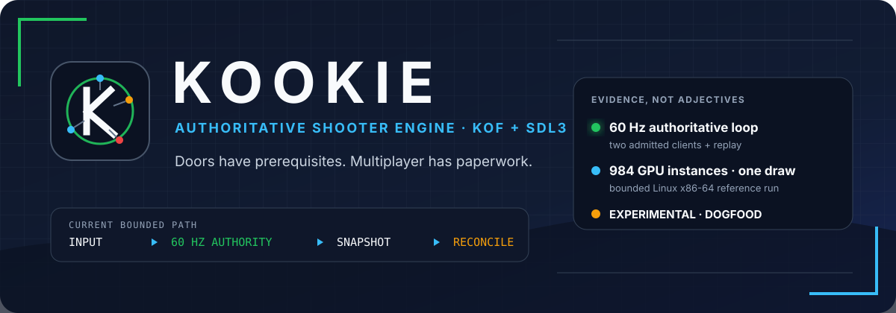
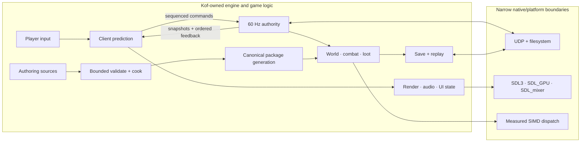

<p align="center">
  
</p>

<p align="center">
  <a href="https://github.com/rufl/KOOKIE/actions/workflows/verify.yml"></a>
  <a href="https://github.com/rufl/KOOKIE/releases"></a>
  
  <a href="LICENSE"></a>
  
</p>

<p align="center">
  <strong>An experimental 3D shooter engine built around Kof.</strong><br>
  Boomer-shooter combat, ARPG structure, authoritative multiplayer and a
  fail-closed content pipeline—without a general-purpose engine behind it.
</p>

<p align="center">
  <a href="#quick-start">Quick start</a> ·
  <a href="#the-shape-of-the-engine">Architecture</a> ·
  <a href="https://github.com/rufl/KOOKIE/releases">Dogfood releases</a> ·
  <a href="docs/RUNNING_AND_PACKAGING.md">Build and package</a> ·
  <a href="pt-BR/README.md">Português (Brasil)</a>
</p>

> **Experimental, deliberately.** KOOKIE is an engine lab, not a finished game
> or a general-purpose engine. Claims below are limited to the focused probes,
> hardware and workloads that produced them.

## Start here

| If you want to… | Go here |
|---|---|
| Run the current authoritative demo | [Quick start](#quick-start) |
| Download a signed Linux dogfood build | [Releases](https://github.com/rufl/KOOKIE/releases) |
| Understand the boundaries | [Architecture](docs/ARCHITECTURE.md) |
| Build, package or run qualification roles | [Running and packaging](docs/RUNNING_AND_PACKAGING.md) |
| See the evidence and open work | [Engine plan](docs/ENGINE_PLAN.md) and [G0 backlog](docs/G0_BACKLOG.md) |
| Change the project | [Contributing](CONTRIBUTING.md) |

## Why this exists

Most engines optimize for broad applicability. KOOKIE optimizes for inspectable
authority boundaries and claims that can be reproduced.

Portable engine, game and tool decisions stay in Kof. C owns narrow,
explicit platform boundaries: SDL3/SDL_GPU, SDL_mixer, UDP, filesystem
durability and measured SIMD dispatch. A feature is not called done because a
class or menu exists; it needs an executable path and a stated proof limit.

The result is intentionally opinionated:

- the server decides combat, loot, progression and persistence;
- clients predict presentation-safe movement, then reconcile;
- source assets cross bounded validation and canonicalization before runtime;
- malformed state, packages, saves and compatibility offers fail closed;
- release artifacts bind source and toolchain provenance with signatures.

## Quick start

Prerequisites: [Kof 0.5.0-beta](https://github.com/KofLang/Kof4j) and Python 3.

```bash
git clone https://github.com/rufl/KOOKIE.git
cd KOOKIE
kof run src/main.kf --target native
```

Run the focused gameplay/replay path:

```bash
bash scripts/verify_interactions.sh
```

The JVM target is retained for local differential qualification, not as a
distributed fallback. Presentation packages additionally require SDL 3.4.16,
SDL_mixer 3.2.4 and `glslc`. Exact package, cooker, Windows-shell and
cross-host qualification commands live in
[Running and packaging](docs/RUNNING_AND_PACKAGING.md).

## What works today

| Area | Implemented bounded path |
|---|---|
| **Authority and networking** | 60 Hz server/client sessions, two-client admission, authenticated compatibility handshake, sequenced commands, snapshots, prediction/reconciliation, reconnect and replay/tamper rejection |
| **Shooter and ARPG systems** | Hitscan/projectile/shotgun combat, enemy roles, deterministic loot, inventory, equipment, skills, status effects, bosses, rewards and exactly-once progression |
| **World and presentation** | True 3D authored arena with slopes, steps and stacked rooms; capsule/triangle collision; doors, secrets and exits; semantic HUD; SDL_GPU instancing; positional gain/pan through SDL_mixer |
| **Content and creator tooling** | Bounded GLB, Dust3D, Aseprite, VOX, Quake-style brush, Blockbench, PNG and WAV intake; canonical products; `.kpkg` validation; transactional Creator edits and frame-boundary reload |
| **Persistence and release** | Checksummed replay, schema migrations, crash-durable save publication, signed clean-tree packages, dependency closure and outside-checkout smoke |
| **Runtime targets** | Authoritative native Linux x86-64; JVM comparison target; persistent native Windows menu/options/lobby shell while Kof PE gameplay remains unavailable |

## The shape of the engine



Kof owns decisions. Native code owns explicit ABI and platform boundaries.
Presentation consumes authoritative state; it does not award damage, loot or
progression. See [Architecture](docs/ARCHITECTURE.md) for the full contracts.

## Engineering evidence

These numbers describe exact retained qualification workloads—not general
performance claims.

| Evidence | Recorded result | Boundary |
|---|---:|---|
| Authoritative session | 60 Hz, host + two clients | Same-host process qualification; G4 also passed across three isolated Linux network namespaces |
| G5 simulation soak | p95 **3.202 ms/tick**; RSS within **128 KiB** after warm-up | 30 minutes on one Linux x86-64 workstation; 64 enemies, 256 projectiles, 512 pickups, 24 lights, 64 effects |
| SDL_GPU reference scene | **984** hardware triangle instances in **one draw**; p95 submission **0.645 ms** | 600 frames at 1920×1080 on recorded Intel Arrow Lake graphics |
| Kof buffer SIMD probe | 64 MiB batch: scalar **233.350 ms**, AVX2 **1.074 ms** | Exact reduction ABI/workload only; not a gameplay-wide speedup claim |
| Release chain | Ed25519-signed archive, manifest and checksum set | Clean source tree, pinned Kof source and verified distribution digest required |

## Content that crosses the boundary

The cooker accepts documented subsets rather than claiming general format
compatibility:

`GLB` · `Dust3D` · `Aseprite` · `VOX` · `MAP` · `Blockbench` · `PNG` · `WAV`

It emits bounded canonical geometry/collision, RGBA8 images/atlases, `KCHR`
characters, PCM16 audio and package-ready checksums. Products are reopened and
validated before atomic publication; failed imports keep the prior generation
active.

```bash
scripts/kookie_cooker.sh cook blockbench character.bbmodel character.kchar
scripts/kookie_cooker.sh cook png texture.png texture.rgba.png
scripts/kookie_cooker.sh cook wav effect.wav effect.pcm16.wav
```

Limits are part of the contract, not temporary documentation omissions. See
[Additional intake hardening](docs/ARCHITECTURE.md#additional-intake-hardening)
for the production work still open.

## Honest boundaries

- Transport and timing evidence is still same-host and Linux-focused; there is
  no retained fresh three-physical-machine qualification bundle.
- Linux x86-64 is the authoritative Kof gameplay target. The Windows build is
  an interactive native shell, not proof of Windows Kof gameplay.
- Importers support small, explicit profiles—not arbitrary files from each
  named format.
- Live reload covers validated scene/render products, not arbitrary Kof code,
  shaders, editor plugins or unbounded streaming.
- Full physics, WAN qualification, broader OS/GPU coverage, streamed/compressed
  audio, HRTF/EFX, richer G6 authoring and sandboxed runtime extensions remain
  unfinished.

If a claim lacks a focused test or probe, it is not presented as complete.

## Repository map

| Path | Purpose |
|---|---|
| [`src/`](src/) | Kof-owned engine, game, session, content and UI logic |
| [`native/`](native/) | Narrow SDL, transport, persistence and SIMD adapters |
| [`apps/`](apps/) | Packaged server, cooker, SIMD benchmark and platform tools |
| [`probes/`](probes/) | Focused executable evidence at risky boundaries |
| [`scripts/`](scripts/) | Verification, packaging and qualification automation |
| [`docs/`](docs/) | Architecture, plans, language notes and research evidence |

## Documentation

- [Architecture](docs/ARCHITECTURE.md) — authority, data flow and runtime
  boundaries.
- [Engine plan](docs/ENGINE_PLAN.md) — gate definitions, measurements and
  deferred scope.
- [Running and packaging](docs/RUNNING_AND_PACKAGING.md) — developer,
  release, cooker and qualification commands.
- [Kof language notes](docs/KOF_LANGUAGE.md) — syntax, targets, FFI and runtime
  findings.
- [Executed probes](docs/RESEARCH_PROBES.md) — commands, results and proof
  limits.
- [Changelog](CHANGELOG.md) — recent behavior changes.
- [Project memory](MEMORY.md) — current decisions, caveats and next action.

Public documentation is mirrored in
[Brazilian Portuguese](pt-BR/README.md).

## Contributing

Read [CONTRIBUTING.md](CONTRIBUTING.md) before changing dependencies,
authority boundaries or qualification claims. During development, run the
smallest focused check that proves the change. The complete gate is:

```bash
bash scripts/verify.sh
```

Graphical checks must use the repository's reviewed isolated-display contract;
never target an active desktop or physical monitor. Security-sensitive findings
belong in the [private reporting path](SECURITY.md), not a public issue.

## License and provenance

KOOKIE is [MIT licensed](LICENSE). Distributed runtime dependencies are
permissive: SDL 3.4.16 and SDL_mixer 3.2.4 use the zlib License. Exact versions,
sources and notices are recorded in
[THIRD_PARTY_NOTICES.txt](THIRD_PARTY_NOTICES.txt).

The Kof compiler is an external build tool and is not distributed with KOOKIE.
Java remains local qualification-only and is excluded from product archives.
