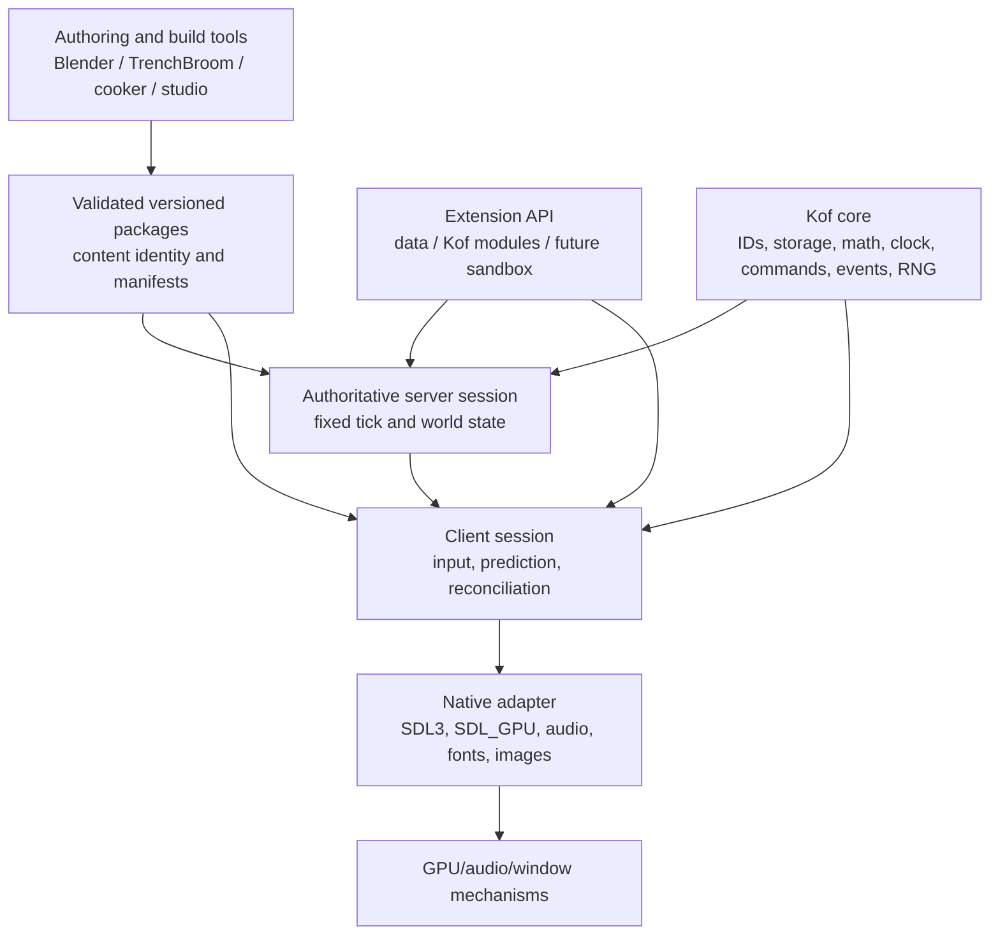
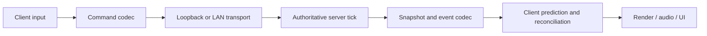

# KOOKIE project architecture

Status: **proposed architecture; implementation has not started**.

This document is the project-level architecture authority. Detailed acceptance
experiments remain in [ENGINE_PLAN.md](ENGINE_PLAN.md). Reuse decisions remain
in [MONOREPO_REUSE.md](MONOREPO_REUSE.md).

## 1. Product boundary

KOOKIE is a true-3D, multiplayer-first, content-driven FPS engine supporting
boomer-shooter, looter-shooter and ARPG-FPS rulesets on one simulation and
content foundation.

Every play is a network session:

- Single-player is a local listen server plus a local client over serialized
  loopback transport.
- LAN play is a host server plus local and remote clients.
- Dedicated play is a headless server plus remote clients.

There is no privileged offline simulation path.

## 2. Architectural decisions

1. **Modular monolith:** one Kof runtime, one authoritative simulation, static
   modules, no dynamic plugin ABI initially.
2. **Server authority:** the server owns simulation, persistence, RNG, combat,
   inventory, progression, world generation and extension authority.
3. **Kof ownership:** engine-owned CPU behavior stays in `.kf`.
4. **Thin native boundary:** native code adapts SDL/GPU/audio/font/image
   mechanisms; it does not own gameplay or scene algorithms.
5. **Stable extension API:** public extensions use versioned IDs, queries,
   commands, events, registries and snapshots rather than internal arrays.
6. **Data first:** content packages are validated, versioned, namespaced and
   atomically published before runtime admission.
7. **Bounded behavior:** queues, memory, packet sizes, entity counts, script
   work and extension effects have explicit limits and failure outcomes.
8. **No hidden authority:** renderer, client, editor, audio and mods cannot
   silently mutate authoritative server state.

## 3. Layer model



### Kof core

Stable, dependency-light contracts:

- Generation-safe IDs and typed storage.
- Math kernels and caller-owned scratch buffers.
- Fixed clock and tick policy.
- Input commands and domain events.
- Deterministic RNG streams.
- Limits, capacity results and overflow policy.
- Revision/generation validation.
- Public handles, query views, command buffers and snapshots.

Core does not import gameplay, rendering, UI, editor code or native handles.

### Server modules

The server owns mutable authoritative state:

- `world`: entities, level state, spatial queries and collision.
- `gameplay`: movement, weapons, damage, AI, encounters and interactions.
- `arpg`: items, affixes, skills, progression, statuses and loot.
- `content`: definitions, package admission, migrations and identity.
- `session`: admission, tick ownership, replication, persistence and roles.
- `extensions`: registries, capability checks and server extension execution.

Server systems read approved state, emit bounded commands and commit mutations at
defined tick phases. Stable IDs and declared ordering break ties.

### Client modules

The client owns no authoritative game state. It owns:

- Platform input capture.
- Tick-stamped input commands.
- Local prediction where explicitly allowed.
- Snapshot application and reconciliation.
- Render/audio/UI extraction.
- Client-only presentation extensions.

Client prediction never decides damage, loot, inventory, progression or world
persistence.

### Presentation modules

`render`, `audio`, `animation` and `ui` consume read-only snapshots/events:

```text
server snapshot/events
        ↓
client prediction/reconciliation
        ↓
render/audio/UI extraction
        ↓
visibility, sorting, batching and pass policy
        ↓
checked native adapter
```

Presentation cannot write authoritative arrays or award gameplay results.

### Native adapter

The initial native stack is SDL3 + SDL_GPU, with Vulkan/SPIR-V first. Optional
mechanism libraries include OpenAL Soft, FreeType/HarfBuzz, SDL3_image and
zstd.

The adapter owns:

- Window and event polling.
- GPU resources and submission.
- Audio device/mixing mechanisms.
- Font shaping/rasterization mechanisms.
- Image decoding mechanisms.
- Checked native resource registries.

The adapter does not own entities, collision, gameplay, content semantics,
render policy or save logic. Native crossing uses checked scalars, tokens and
bounded buffers; no raw Kof pointers or callbacks are retained.

## 4. Runtime modes



### Local listen server

The player process contains:

```text
server world
client presentation world
loopback transport
```

The transport still encodes and decodes bounded messages. It may avoid physical
socket latency, but it cannot pass world references directly.

### LAN host

The host contains an authoritative server and a local client. Remote peers use
the same client protocol. The host is not trusted merely because it also renders
a local client; authority remains in the server session.

### Dedicated server

The dedicated server contains no graphics requirement and runs the same server
modules, content admission, extension roles, save system and replication code.

### Transport contract

The protocol is transport-independent:

- Reliable ordered control channel for handshake, admission, join/leave,
  required commands and session metadata.
- Unreliable sequenced channel for input and superseding snapshots.
- Explicit tick, sequence, acknowledgement, baseline and content-revision
  fields.
- Bounded packet size, decode work, queue length and entity count.
- Rejection of stale commands, invalid handles, incompatible content and
  unsupported capabilities.

The third-party networking library is selected after the protocol and loopback
proof, not before.

## 5. Extension architecture

Extensions have two API levels:

- Private internal module APIs optimized for the engine.
- A versioned public API that must remain stable across internal refactors.

Extension tiers:

### Data packages

Items, weapons, enemies, encounters, levels, materials, UI data, localization,
recipes, progression and schemas. IDs are namespaced, for example
`example_mod:plasma_rifle`.

### Trusted Kof modules

Statically compiled `.kf` extensions can register components, systems, AI,
world generation, commands, serializers, editor tools, save migrations and
network codecs.

### Future sandboxed behavior

A later script/bytecode tier may provide no-rebuild behavior. It must use the
same public contracts and explicit capability budgets. It must not receive raw
pointers, native handles, mutable core arrays, arbitrary filesystem/network
access or unbounded iteration.

### Extension manifest

Every extension declares:

```text
namespace and identity
engine/API/schema versions
dependencies
capabilities
server/client/shared/data role
content declarations
load order
save migrations
network schemas
provenance and hashes
```

Public extension operations are:

- Registry contribution.
- Read-only world queries.
- Bounded command buffers.
- Typed event subscriptions.
- Phase-specific system hooks.
- Seeded world/encounter generation.
- Render/audio/UI extraction.
- Save migrations.
- Network codec and replication-schema registration.

Systems execute in dependency order, then declared priority, then namespaced
ID. Conflicts and capacity failures fail closed with diagnostics.

## 6. Content and asset pipeline

```text
editable sources
      ↓
Kof cooker and validators
      ↓
staged package
      ↓
checksums, identity, dependency and schema validation
      ↓
atomic publication
      ↓
server/client admission
```

Packages contain:

- Magic and format version.
- Engine/tool/content versions.
- Stable namespaced IDs.
- Explicit endianness.
- Bounded chunk offsets and lengths.
- Dependency hashes.
- Coordinate/unit convention.
- Optional signatures.
- Provenance receipts.

### Supported authoring intake

The cooker accepts these authoring sources in addition to the canonical glTF
subset. They are **offline intake formats**, not runtime formats:

| Source | Intake contract | Canonical result |
|---|---|---|
| Dust3D `.ds3` | Preserve the editable project as provenance; validate exported geometry, UVs, skeleton/animation metadata and finite transforms | Static or skeletal GLB, material/texture records and optional collision source |
| LibreSprite `.ase` / `.aseprite` | Read frames, layers, tags, slices, palette and pixel bounds; reject unsupported color/depth modes or normalize them explicitly | PNG atlas plus versioned frame/tag JSON and Kof animation definitions |
| MagicaVoxel `.vox` | Read bounded voxel models, dimensions, palette and supported scene chunks; preserve palette/index semantics and reject unsupported chunks with diagnostics | Deterministic mesh/GLB, palette/material records and optional voxel-derived collision |

Canonical intake rules:

- Keep the original source file and tool/version receipt; never serialize an
  editor's private memory layout into a package.
- Normalize coordinates, scale, winding, normals, UV origin, frame rate and
  material/color semantics before publication.
- Use stable namespaced asset IDs and preserve source-to-output mappings.
- Prefer GLB for 3D interchange and PNG plus metadata for sprite interchange;
  OBJ/FBX or other exports are fallback conversion inputs, not runtime
  contracts.
- Validate counts, dimensions, indices, palette references, image sizes,
  animation durations, finite numeric values and decoded memory before staging.
- A failed or unsupported conversion retains the previous valid package.

Dust3D is an MIT-licensed external authoring project. LibreSprite is GPLv2 and
must remain an external tool or independently implemented format intake; do not
embed LibreSprite code in KOOKIE. MagicaVoxel is proprietary freeware; do not
bundle or redistribute its application. Reading the documented `.vox` format
and accepting user-provided `.vox` files is separate from bundling the tool.
Record all source/tool notices in package provenance.


The cooker owns scene, collision, gameplay and package semantics. Native image,
font and audio libraries only provide narrow decoding mechanisms.

Publication is transactional: stage, validate, publish or retain the previous
valid package. Geometry, collision, navigation and replication revisions must
be published together.

### Corpus-derived intake details to settle


The monorepo projects suggest several contracts worth fixing before parser
implementation:

1. **Source receipts:** record source path, SHA-256, tool/version, options,
   dependency hashes, coordinate convention and generated-output hashes.
   Receipts identify bytes and settings; they do not prove artistic or runtime
   correctness.
2. **Canonical import record:** every importer emits the same bounded record:
   source identity, stable asset ID, output artifacts, warnings, limits,
   dependencies, coordinate transform and validation result.
3. **Stable bindings:** preserve frame IDs, layer/tag IDs, node/material IDs and
   source-to-output mappings across rename, reorder and re-export. Never bind
   gameplay or animation to array position.
4. **Reopen validation:** after cooking, reopen the generated GLB, atlas,
   metadata and collision products through the runtime readers. A successful
   exporter process is not sufficient proof.
5. **Atomic product sets:** mesh, materials, textures, animation, collision,
   navigation and replication metadata publish as one revision. Reject mixed
   old/new products.
6. **Dry-run conversion plans:** show accepted files, output IDs, warnings,
   estimated decoded memory and external tools before mutation. External
   conversion is an explicit build/tool step, never hidden runtime execution.
7. **Bounded jobs:** imports have input-size, decoded-memory, output-count,
   recursion and cancellation limits. Partial failures retain per-source
   diagnostics and never publish incomplete artifacts.
8. **Deterministic normalization:** the same source, tool version, options and
   dependency set produce the same canonical output or an explicit
   nondeterminism diagnostic.
9. **Cache generations:** derived meshes, atlases, collision and navigation are
   keyed by source/dependency/revision identity. Readers retain old generations
   until the frame/session boundary retires them.
10. **Corpus fixture set:** retain tiny valid, malformed, oversized, unsupported
    and round-trip fixtures for each intake format. Test semantic behavior,
    bounds and stale-publication rejection, not just parser acceptance.

These contracts borrow behavior from CHARAMELD, SPRITEFORM, CARVER, ZYLVE,
DINX, ZNAP, ARCGEN, ZFONT and ZWAVE without importing their runtimes or
foreign ownership models.


## 7. Persistence and replay

Saves are server-owned and contain versioned semantic sections:

- Character and progression.
- Item instances and ownership.
- World persistence.
- Quest and encounter state.
- Explicit RNG streams where required.
- Engine/content/extension identities.

Rules:

- Snapshot at a defined tick boundary.
- Stage, validate, checksum, flush and atomically replace.
- Migrate schemas, never raw slots or pointers.
- Reject newer required sections without destroying the old save.
- Save rolled item results, not only RNG state.

Replay stores:

```text
engine/content/extension identities
initial snapshot and seed
tick commands
periodic authoritative checkpoints/state hashes
```

Replay re-simulates from checkpoints. Presentation timestamps are insufficient.

## 8. Repository layout

```text
engines/KOOKIE/
  docs/
    ARCHITECTURE.md
    ENGINE_PLAN.md
    MONOREPO_REUSE.md
    KOF_LANGUAGE.md
    KOF_EDITOR.md
    ...

  src/
    core/          IDs, storage, math, clock, commands, events, RNG
    platform/      Kof extern declarations and checked wrappers
    session/       server/client roles, admission, snapshots, prediction
    net/           messages, codecs, channels, sequence/ack state
    world/         entities, spatial queries, levels, collision
    gameplay/      movement, weapons, damage, AI, encounters
    arpg/          items, stats, loot, skills, progression
    content/       schemas, validation, packages, migrations
    extensions/    manifests, registries, capabilities, public adapters
    render/        extraction, culling, sorting, batching, passes
    animation/     clips, pose state, interpolation
    audio/         voice policy, spatialization, event mapping
    ui/            HUD, menus, inventory, debug/editor views

  apps/
    player/        integrated server + client or LAN client
    server/        headless dedicated server
    cooker/        package validation and cooking
    studio/        editor and authoring tools
  probes/          focused compiler, ABI and session probes


  samples/         multiplayer sample games and content
  native/          indispensable ABI/library adaptation only
  shaders/         GPU shader sources and generated products
  content/         authored source assets and definitions
```

Kof's current source collection means these are logical ownership boundaries
first. The application root composes the required modules. There is no generic
service locator and no public dynamic plugin ABI at the initial stage.

## 9. Dependency rules

```text
core
  ↓
content contracts
  ↓
world/collision
  ↓
gameplay
  ↓
arpg

core + read-only snapshots/events
  ├── render
  ├── audio
  ├── animation
  └── ui

content + world queries
  ├── cooker
  ├── editor/studio
  └── extensions

platform/native
  └── mechanisms only
```

Required rules:

1. One authoritative server world.
2. No foreign ECS or second gameplay authority.
3. No renderer/client/editor mutation of authoritative arrays.
4. No raw pointers or runtime slots in saves or network packets.
5. No extension access to private component storage.
6. No arbitrary callback mutation during simulation iteration.
7. All structural changes commit at known boundaries.
8. Every queue, pool, packet and extension has explicit capacity behavior.
9. Stale revisions and incompatible manifests fail closed.
10. Dynamic plugins and runtime scripts are later gates, not G0 dependencies.

## 10. Implementation gates

### G0 — Native and session feasibility

Prove the Kof native compiler/runtime corrections, SDL startup, checked adapter,
real GPU/audio lifecycle, bounded wire envelope and loopback codecs.

### G1 — Authoritative shooter foundation

Implement IDs, typed arrays, server tick, client commands, loopback session,
snapshot baselines, prediction/reconciliation, capsule collision and one weapon
and enemy.

### G2 — LAN boomer-shooter slice

Add LAN transport, host plus multiple clients, join/leave/reconnect handling,
hitscan/projectiles, encounters and server-owned rewards.

### G3 — Looter/ARPG multiplayer slice

Add item instances, inventory, skills, statuses, progression, authoritative
saves and replicated extension schemas.

### G4 — Creator and extension pipeline

Add package cooker, data mods, trusted Kof modules, registries, manifests,
editor transactions and staged multiplayer content publication.

### G5 — Scale and release

Add headless dedicated server, workload budgets, migration/replay hardening,
reconnect/session recovery, packaging and notices.

### G6 — Expansion

Evaluate additional platforms, safe jobs, WAN transport, richer editor and a
sandboxed runtime extension tier.

## 11. Explicit non-goals

- A C/Zig/Rust gameplay engine hidden behind Kof.
- A single giant runtime coordinator.
- A foreign ECS replacing Kof ownership.
- Dynamic native plugins as the initial mod system.
- Offline gameplay that bypasses replication.
- Cross-platform float lockstep claims.
- Raw memory serialization.
- Unbounded mod callbacks or service locators.
- Reusing sibling engines or assets without license/provenance clearance.
