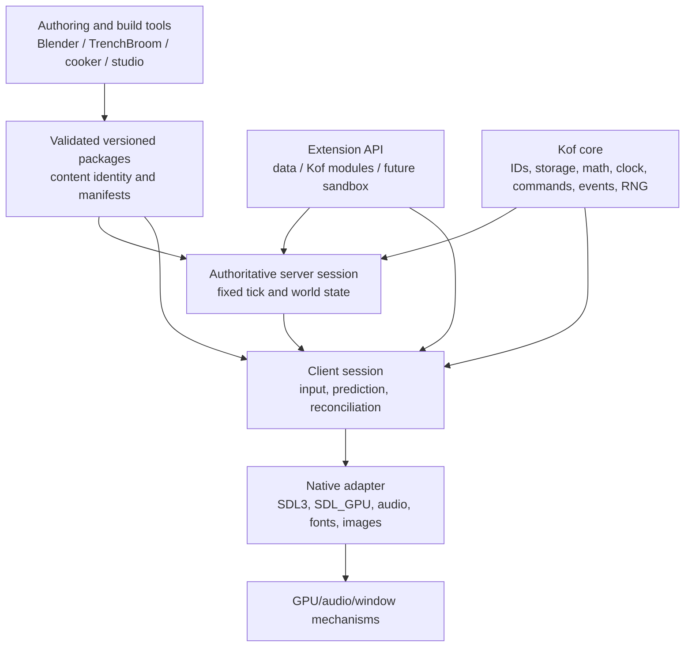
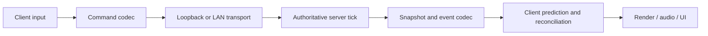

# KOOKIE project architecture

Status: **living target architecture; the bounded G0–G4 implementation is complete within the documented qualification limits**.


This document is the project-level architecture authority. Detailed acceptance
experiments remain in [ENGINE_PLAN.md](ENGINE_PLAN.md).

## 1. Product boundary

KOOKIE is a true-3D, multiplayer-first, content-driven FPS engine supporting
boomer-shooter, looter-shooter and ARPG-FPS rulesets on one simulation and
content foundation.

Every play is a network session:

- Single-player is a local listen server plus a local client over serialized
  loopback transport.
- LAN play is a host server plus local and remote clients.
- Dedicated play is a headless server plus remote clients.

There is no privileged offline simulation path.

## 2. Architectural decisions

1. **Modular monolith:** one Kof runtime, one authoritative simulation, static
   modules, no dynamic plugin ABI initially.
2. **Server authority:** the server owns simulation, persistence, RNG, combat,
   inventory, progression, world generation and extension authority.
3. **Kof ownership:** engine-owned CPU behavior stays in `.kf`.
4. **Thin native boundary:** native code adapts SDL/GPU/audio/font/image
   mechanisms; it does not own gameplay or scene algorithms.
5. **Stable extension API:** public extensions use versioned IDs, queries,
   commands, events, registries and snapshots rather than internal arrays.
6. **Data first:** content packages are validated, versioned, namespaced and
   atomically published before runtime admission.
7. **Bounded behavior:** queues, memory, packet sizes, entity counts, script
   work and extension effects have explicit limits and failure outcomes.
8. **No hidden authority:** renderer, client, editor, audio and mods cannot
   silently mutate authoritative server state.

## 3. Layer model


```mermaid
flowchart TB
    Tools[Authoring and build tools\nBlender / TrenchBroom / cooker / studio]
    Packages[Validated versioned packages\ncontent identity and manifests]
    Extensions[Extension API\ndata / Kof modules / future sandbox]
    Server[Authoritative server session\nfixed tick and world state]
    Client[Client session\ninput, prediction, reconciliation]
    Core[Kof core\nIDs, storage, math, clock, commands, events, RNG]
    Native[Native adapter\nSDL3, SDL_GPU, audio, fonts, images]
    GPU[GPU/audio/window mechanisms]

    Tools --> Packages
    Packages --> Server
    Packages --> Client
    Extensions --> Server
    Extensions --> Client
    Core --> Server
    Core --> Client
    Server --> Client
    Client --> Native
    Native --> GPU
```

### Kof core

Stable, dependency-light contracts:

- Generation-safe IDs and typed storage.
- Math kernels and caller-owned scratch buffers.
- Fixed clock and tick policy.
- Input commands and domain events.
- Deterministic RNG streams.
- Limits, capacity results and overflow policy.
- Revision/generation validation.
- Public handles, query views, command buffers and snapshots.

Core does not import gameplay, rendering, UI, editor code or native handles.

### Server modules

The server owns mutable authoritative state:

- `world`: entities, level state, spatial queries and collision.
- `gameplay`: movement, weapons, damage, AI, encounters and interactions.
- `arpg`: items, affixes, skills, progression, statuses and loot.
- `content`: definitions, package admission, migrations and identity.
- `session`: admission, tick ownership, replication, persistence and roles.
- `extensions`: registries, capability checks and server extension execution.

Server systems read approved state, emit bounded commands and commit mutations at
defined tick phases. Stable IDs and declared ordering break ties.

### Client modules

The client owns no authoritative game state. It owns:

- Platform input capture.
- Tick-stamped input commands.
- Local prediction where explicitly allowed.
- Snapshot application and reconciliation.
- Render/audio/UI extraction.
- Client-only presentation extensions.

Client prediction never decides damage, loot, inventory, progression or world
persistence.

### Presentation modules

`render`, `audio`, `animation` and `ui` consume read-only snapshots/events:

```text
server snapshot/events
        ↓
client prediction/reconciliation
        ↓
render/audio/UI extraction
        ↓
visibility, sorting, batching and pass policy
        ↓
checked native adapter
```

Presentation cannot write authoritative arrays or award gameplay results.

The implemented bounded slice follows this boundary: authoritative combat
resolutions emit monotonic `ImpactPresentationEvent` records; ordered feedback
batches carry every confirmed event into bounded client HUD/audio queues.
The HUD derives tick-limited hit/kill/damage geometry plus shape-distinct
connection, encounter, elite/boss threat/defeat, G3
inventory/equipment/skill/world-loot status and G4 creator-publication status.
Presentation overflow is diagnosed and never rolls back authoritative state.
Authored 3D doors add a 36-vertex cuboid between the 78-vertex arena and
372-vertex HUD; the current fixed scene is 486 vertices. Kof derives distance
attenuation and stereo pan before the native adapter submits left/right PCM to
independent SDL_mixer effects and music streams.


### Native adapter

The native stack is SDL3 + SDL_GPU + SDL_mixer 3.2.4, with Vulkan/SPIR-V
first. Future distributed mechanism libraries must remain permissively
licensed; current candidates include FreeType/HarfBuzz, SDL3_image and zstd.

The adapter owns:

- Window and event polling.
- GPU resources and submission.
- Audio device/mixing mechanisms.
- Font shaping/rasterization mechanisms.
- Image decoding mechanisms.
- Checked native resource registries.

The adapter does not own entities, collision, gameplay, content semantics,
render policy or save logic. Native crossing uses checked scalars, tokens and
bounded buffers; no raw Kof pointers or callbacks are retained.

The Windows compiler boundary consumes optimized IR from the exact pinned Kof
frontend and emits deterministic C11, AMD64 COFF and console PE artifacts. Its
admitted subset is top-level integral/Boolean/String functions, locals,
arithmetic, control flow and printing. Classes, heap/array operations,
exceptions, concurrency, FFI and SDL IR fail closed with `PE001`. Generated C is
a compiler intermediate, not a second hand-written engine authority. This path
qualifies executable format and lowering mechanics only; Linux remains the
full native gameplay target.

## 4. Runtime modes


```mermaid
flowchart LR
    Input[Client input] --> Encode[Command codec]
    Encode --> Transport[Loopback or LAN transport]
    Transport --> Server[Authoritative server tick]
    Server --> Snapshot[Snapshot and event codec]
    Snapshot --> Predict[Client prediction and reconciliation]
    Predict --> Present[Render / audio / UI]
```

### Local listen server

The player process contains:

```text
server world
client presentation world
loopback transport
```

The transport still encodes and decodes bounded messages. It may avoid physical
socket latency, but it cannot pass world references directly.

### LAN host

The host contains an authoritative server and a local client. Remote peers use
the same client protocol. The host is not trusted merely because it also renders
a local client; authority remains in the server session.

### Dedicated server

The dedicated server contains no graphics requirement and runs the same server
modules, content admission, extension roles, save system and replication code.

### Transport contract

The protocol is transport-independent:

- Reliable ordered control channel for handshake, admission, join/leave,
  required commands and session metadata.
- Unreliable sequenced channel for input and superseding snapshots.
- Explicit tick, sequence, acknowledgement, baseline and content-revision
  fields.
- Bounded packet size, decode work, queue length and entity count.
- Rejection of stale commands, invalid handles, incompatible content and
  unsupported capabilities.


The implemented G2 protocol uses fixed 11-word commands and recipient-specific
20-word player/progression state. A dynamic checksummed encounter message uses
`20 + 8N` words for at most 32 enemies; each entry contains stable ID, role,
state, target, health and integer 3D position. An ordered feedback message uses
`6 + 11F` words for at most 16 impact events. Join sends valid tick-zero
gameplay, feedback and encounter baselines. Decode validates a whole message
before mutation, admits generation before sequence, rejects stale or gapped
state and never treats dropped presentation as failed authoritative state.

Before snapshots or gameplay commands, each remote endpoint exchanges a bounded
compatibility control handshake. The client offer is 18 words: framing,
sequence, the exact 13-word `BoundedContentCompatibility` identity and a
checksum. The server response is 7 words with accepted/rejected status,
diagnostic, sequence and server-identity checksum. Decode, checksum, sequence
and exact identity comparison complete before the endpoint becomes ready;
mismatch and malformed offers receive a rejection response and cannot advance
gameplay state. SipHash transport framing supplies packet authentication and
integrity. The compatibility checksum is an identity/error-detection field, not
a cryptographic authenticator. JVM and native role processes use this same
wire path; current G4 evidence does not retain a fresh three-machine run.

The third-party networking library is selected after the protocol and loopback
proof, not before.

## 5. Extension architecture

Extensions have two API levels:

- Private internal module APIs optimized for the engine.
- A versioned public API that must remain stable across internal refactors.

Extension tiers:

### Data packages

Items, weapons, enemies, encounters, levels, materials, UI data, localization,
recipes, progression and schemas. IDs are namespaced, for example
`example_mod:plasma_rifle`.

### Trusted Kof modules

Statically compiled `.kf` extensions can register components, systems, AI,
world generation, commands, serializers, editor tools, save migrations and
network codecs.

### Sandboxed KofScript behavior

`BoundedKofScriptProgram` is the no-rebuild bytecode tier. Its canonical
artifact declares one domain-event subscription, forward-only control flow,
stack/instruction/output budgets and explicit command/event capability masks.
The verifier rejects loops, unreachable code, inconsistent branch stack depth,
undeclared outputs and checksum corruption before execution. The preallocated
VM rejects arithmetic overflow and discards all staged output on failure.

Programs receive only copied integer event fields and can emit only the
versioned public command/event records admitted by their masks. Currency
commands cross the same atomic authoritative-session application gate as
trusted hooks. There are no raw pointers, native handles, mutable core arrays,
filesystem/network opcodes or unbounded iteration. The offline KofScript builder
emits the artifact; JVM and native Kof runtimes reopen and execute identical
words.

### Extension manifest

Every extension declares:

```text
namespace and identity
engine/API/schema versions
dependencies
capabilities
server/client/shared/data role
content declarations
load order
save migrations
network schemas
provenance and hashes
```

Public extension operations are:

- Registry contribution.
- Read-only world queries.
- Bounded command buffers.
- Typed event subscriptions.
- Phase-specific system hooks.
- Seeded world/encounter generation.
- Render/audio/UI extraction.
- Save migrations.
- Network codec and replication-schema registration.

Systems execute in dependency order, then declared priority, then namespaced
ID. Conflicts and capacity failures fail closed with diagnostics.

The G4 trusted-module path does not expose arbitrary callbacks.
`BoundedTrustedModuleRegistry` binds at most 32 statically compiled hook IDs
and binary versions to declared manifest contributions, event kinds, phases and
command/event budgets. `BoundedTrustedHookRuntime` accepts only a sealed module
whose extension/module checksums match a published generation, dispatches
typed session-started, player-connected, enemy-defeated, loot-picked-up and
editor-published events in monotonic sequence/phase order, and preflights every
per-hook/global capacity before emission. Registered static implementations
produce bounded audit/welcome/bounty/publication events; the authoritative
session consumes the grant-currency command exactly once after aggregate
overflow validation. Hooks never receive mutable core access.

## 6. Content and asset pipeline

```text
editable sources
      ↓
Kof cooker and validators
      ↓
staged package
      ↓
checksums, identity, dependency and schema validation
      ↓
atomic publication
      ↓
server/client admission
```

Packages contain:

- Magic and format version.
- Engine/tool/content versions.
- Stable namespaced IDs.
- Explicit endianness.
- Bounded chunk offsets and lengths.
- Dependency hashes.
- Coordinate/unit convention.
- Optional signatures.
- Provenance receipts.

### Supported authoring intake

The file cooker accepts these authoring sources in addition to the canonical
indexed glTF subset. They are **offline intake formats**, not runtime formats:

| Source | Implemented bounded contract | Canonical result |
|---|---|---|
| Dust3D `.ds3` + exported `.glb` | Structurally validate a non-ZIP64, non-encrypted archive up to 1 MiB with a bounded `model.json`; validate one indexed triangle primitive, VEC2 float UV accessor and paired float-weight skin attributes when a skin is declared | Canonical geometry wire, authored collision and source/material checksums |
| LibreSprite `.ase` / `.aseprite` | Up to 8 MiB, 64 frames/layers, 256×256 RGBA frames and 262,144 atlas pixels; raw/zlib cels, normal layers, tags, slices, palette, user data and color profile; reject unknown chunks/modes | Deterministic RGBA PNG atlas, frame durations and metadata checksum |
| MagicaVoxel `.vox` | Versions 150–200, up to eight models and 20 voxels; `PACK`, `SIZE`, `XYZI`, `RGBA`, `nTRN`, `nGRP`, `nSHP` and `LAYR`; reject every other chunk | Deterministic cube geometry/collision plus palette checksum and scene-node count |
| Quake-style `.map` | ASCII integer-grid entity/property and convex brush-plane subset; up to 8,192 tokens, 64 entities, 512 properties, 16 planes per brush and 256 output vertices/triangles | Triangulated canonical geometry/collision plus entity, material and visibility checksums |
| Blockbench `.bbmodel` | Exact format 5.0 JSON up to 1 MiB; cube-only character outliner with at most 64 UUID bones, 128 cuboids, 32 clips, 512 keyframes and depth 16; position/rotation/scale values bounded to ±100,000 and normalized to thousandths, clips up to 600 seconds, and `linear`/`step` interpolation; reject duplicate/unknown UUIDs, Molang, effects and unsupported interpolation | Reopened little-endian `KCHR` v1 with fixed-point cuboids, UUID-bound hierarchy/clips and source/character/bone/animation/canonical checksums; texture pixels and per-face UV/material data are outside `KCHR` v1 |
| PNG `.png` | Up to 1 MiB, 64 chunks and 256×256 pixels; non-interlaced 8-bit color types 0/2/3/4/6, consecutive `IDAT`, zlib, filters 0–4, `PLTE`, `tRNS` and validated `tEXt`; verify CRC/Adler and reject Adam7, APNG, other depths and every other ancillary/unknown chunk | Reopened deterministic non-interlaced RGBA8 PNG plus source, decoded-pixel, metadata and canonical checksums |
| PCM WAVE `.wav` | RIFF/WAVE up to 2 MiB and 32 chunks; exact 16-byte PCM `fmt ` with format tag `0x0001`, mono/stereo, 8–96 kHz, unsigned 8-bit or signed little-endian 16-bit samples, at most 30 seconds and 1 MiB of canonical PCM; admit and strip `JUNK`, `PAD ` and `LIST/INFO`, require zero odd-byte padding, and reject RF64, extensible/float/compressed audio, cues, loops and every other chunk | Reopened deterministic PCM16 WAVE with source, normalized-sample, stripped-metadata and canonical checksums |

Canonical intake rules:

- Keep the original source file and tool/version receipt; never serialize an
  editor's private memory layout into a package.
- Normalize coordinates, scale, winding, normals, UV origin, frame rate and
  material/color semantics before publication.
- Use stable namespaced asset IDs and preserve source-to-output mappings.
- Prefer GLB for 3D interchange and PNG plus metadata for sprite interchange;
  OBJ/FBX or other exports are fallback conversion inputs, not runtime
  contracts.
- Validate counts, dimensions, indices, palette references, image sizes,
  animation durations, finite numeric values and decoded memory before staging.
- A failed or unsupported conversion retains the previous valid package.

Dust3D is an MIT-licensed external authoring project. LibreSprite is GPLv2 and
must remain an external tool or independently implemented format intake; do not
embed LibreSprite code in KOOKIE. MagicaVoxel is proprietary freeware; do not
bundle or redistribute its application. Reading the documented `.vox` format
and accepting user-provided `.vox` files is separate from bundling the tool.
[Blockbench's application is GPL-3.0-or-later](https://github.com/JannisX11/blockbench/blob/e2ede0809ee6bc91f374ac7e00d34cffbdf86a14/LICENSE.MD);
KOOKIE does not bundle it or copy its implementation. The independent reader
targets the upstream
[5.0 project codec](https://github.com/JannisX11/blockbench/blob/e2ede0809ee6bc91f374ac7e00d34cffbdf86a14/js/formats/bbmodel.js)
and accepts only user-provided source files. Record all source/tool notices in
package provenance.

The standalone reader follows the
[W3C PNG Third Edition Recommendation](https://www.w3.org/TR/png-3/) for the
admitted static subset. It preserves sample values without gamma conversion;
color-profile and other semantic ancillary chunks reject, so material policy
must declare the runtime color-space interpretation explicitly.

The WAVE reader independently implements the bounded PCM tag `0x0001`
registered by [RFC 2361](https://www.rfc-editor.org/rfc/rfc2361) and the
RIFF/WAVE loading model documented by
[SDL_LoadWAV](https://wiki.libsdl.org/SDL3/SDL_LoadWAV). It emits static PCM16;
streaming and compressed decoding remain outside this intake contract.

The cooker owns scene, collision, gameplay and package semantics. Native image,
font and audio libraries only provide narrow decoding mechanisms.

Publication is transactional: stage, validate, publish or retain the previous
valid package. Geometry, collision, navigation and replication revisions must
be published together.

`scripts/kookie_cooker.sh` exposes `cook`, `package`, `inspect-package` and
`validate-package` through a JVM developer CLI. Linux archives also contain a
native `kookie-cooker` runner for the same Kof `cook` path; package operations
remain JVM-only. The `.kpkg` envelope stores explicit little-endian headers,
bounded logical paths and chunk payloads.
Its reader rejects traversal, duplicate paths/IDs, overlap, out-of-range bytes,
hash mismatch and corrupt registry records. `BoundedExternalPackageRuntime`
builds candidate package/extension/definition/hook registries and swaps them
only after complete validation; failed reload preserves the active package,
registries and generation.

`BoundedCreatorWorkspace` applies revision-checked world/entity/weapon/loot
transactions to one atomic geometry/collision/navigation/render product set.
The Creator screen exposes inspection toggles, console mutations,
play-in-editor and a bounded 16-entry undo/redo history. The native adapter
keeps the active CPU scene separate while staging a candidate, waits for
synchronous upload-fence completion before reusing its persistent GPU buffer,
then activates at a frame boundary. The Kof coordinator retains referenced
generation identities and permits retirement only after references and the
fence clear. This reload contract covers validated scene products; it is not
arbitrary code, shader or plugin hot reload.

### Additional intake hardening

The implemented parsers already provide bounded source/result checksums,
canonical products, GLB/PNG/WAV reopen validation, deterministic diagnostics
and atomic publication. Remaining production hardening targets include:

1. **Source receipts:** record source path, SHA-256, tool/version, options,
   dependency hashes, coordinate convention and generated-output hashes.
   Receipts identify bytes and settings; they do not prove artistic or runtime
   correctness.
2. **Canonical import record:** every importer emits the same bounded record:
   source identity, stable asset ID, output artifacts, warnings, limits,
   dependencies, coordinate transform and validation result.
3. **Stable bindings:** preserve frame IDs, layer/tag IDs, node/material IDs and
   source-to-output mappings across rename, reorder and re-export. Never bind
   gameplay or animation to array position.
4. **Reopen validation:** after cooking, reopen generated GLB, `KCHR`, PNG/WAV,
   atlas metadata and collision products through the runtime readers. A
   successful exporter process is not sufficient proof.
5. **Atomic product sets:** mesh, materials, textures, animation, collision,
   navigation and replication metadata publish as one revision. Reject mixed
   old/new products.
6. **Dry-run conversion plans:** show accepted files, output IDs, warnings,
   estimated decoded memory and external tools before mutation. External
   conversion is an explicit build/tool step, never hidden runtime execution.
7. **Bounded jobs:** imports have input-size, decoded-memory, output-count,
   recursion and cancellation limits. Partial failures retain per-source
   diagnostics and never publish incomplete artifacts.
8. **Deterministic normalization:** the same source, tool version, options and
   dependency set produce the same canonical output or an explicit
   nondeterminism diagnostic.
9. **Cache generations:** derived meshes, atlases, collision and navigation are
   keyed by source/dependency/revision identity. Readers retain old generations
   until the frame/session boundary retires them.
10. **Corpus fixture set:** retain tiny valid, malformed, oversized, unsupported
    and round-trip fixtures for each intake format. Test semantic behavior,
    bounds and stale-publication rejection, not just parser acceptance.

These contracts are expressed as KOOKIE-owned behavior with explicit,
testable boundaries and no additional runtime ownership model.


## 7. Persistence and replay

Saves are server-owned and contain versioned semantic sections:

- Character and progression.
- Item instances and ownership.
- World persistence.
- Quest and encounter state.
- Explicit RNG streams where required.
- Engine/content/extension identities.

Rules:

- Snapshot at a defined tick boundary.
- Stage, validate, checksum, flush and atomically replace.
- Migrate schemas, never raw slots or pointers.
- Reject newer required sections without destroying the old save.
- Save rolled item results, not only RNG state.

Replay stores:

```text
engine/content/extension identities
initial snapshot and seed
tick commands
periodic authoritative checkpoints/state hashes
```

Replay re-simulates from checkpoints. Presentation timestamps are insufficient.

## 8. Repository layout

```text
engines/KOOKIE/
  docs/
    ARCHITECTURE.md
    ENGINE_PLAN.md
    KOF_LANGUAGE.md
    KOF_EDITOR.md
    ...

  src/
    core/          IDs, storage, math, clock, commands, events, RNG
    platform/      Kof extern declarations and checked wrappers
    session/       server/client roles, admission, snapshots, prediction
    net/           messages, codecs, channels, sequence/ack state
    world/         entities, spatial queries, levels, collision
    gameplay/      movement, weapons, damage, AI, encounters
    arpg/          items, stats, loot, skills, progression
    content/       schemas, validation, packages, migrations
    extensions/    manifests, registries, capabilities, public adapters
    render/        extraction, culling, sorting, batching, passes
    animation/     clips, pose state, interpolation
    audio/         voice policy, spatialization, event mapping
    ui/            HUD, menus, inventory, debug/editor views

  apps/
    player/        integrated server + client or LAN client
    server/        headless dedicated server
    cooker/        package validation and cooking
    studio/        editor and authoring tools
  probes/          focused compiler, ABI and session probes


  samples/         multiplayer sample games and content
  native/          indispensable ABI/library adaptation only
  shaders/         GPU shader sources and generated products
  content/         authored source assets and definitions
```

Kof's current source collection means these are logical ownership boundaries
first. The application root composes the required modules. There is no generic
service locator and no public dynamic plugin ABI at the initial stage.

## 9. Dependency rules

```text
core
  ↓
content contracts
  ↓
world/collision
  ↓
gameplay
  ↓
arpg

core + read-only snapshots/events
  ├── render
  ├── audio
  ├── animation
  └── ui

content + world queries
  ├── cooker
  ├── editor/studio
  └── extensions

platform/native
  └── mechanisms only
```

Required rules:

1. One authoritative server world.
2. No foreign ECS or second gameplay authority.
3. No renderer/client/editor mutation of authoritative arrays.
4. No raw pointers or runtime slots in saves or network packets.
5. No extension access to private component storage.
6. No arbitrary callback mutation during simulation iteration.
7. All structural changes commit at known boundaries.
8. Every queue, pool, packet and extension has explicit capacity behavior.
9. Stale revisions and incompatible manifests fail closed.
10. Dynamic plugins and runtime scripts are later gates, not G0 dependencies.

## 10. Implementation gates

### G0 — Native and session feasibility

Prove the Kof native compiler/runtime corrections, SDL startup, checked adapter,
real GPU/audio lifecycle, bounded wire envelope and loopback codecs.

### G1 — Authoritative shooter foundation

Implemented IDs/component arrays, a 60 Hz authoritative tick, client commands,
two-client loopback admission, snapshot baselines, observable
prediction/reconciliation, capsule/triangle-BVH contact, one weapon/enemy,
camera and a semantic health/ammo/focus/encounter HUD. The authored arena,
shared collision data and fixed SDL_GPU scene staging close G1; sustained
scale/soak remains G5.

### G2 — LAN boomer-shooter slice

Implemented: bounded authenticated transport runs a host plus two clients
through movement, continuous hitscan/projectile/shotgun enemies, authoritative
damage/death/reward, lifecycle and level progression. Recipient-specific join
baselines, generation-first reconnect recovery, client prediction/reconciliation,
3D door collision/render geometry, ordered feedback recovery and Kof-owned
stereo spatialization complete the G2 contract.


### G3 — Looter/ARPG multiplayer slice

Implemented: item instances, inventory/equipment, skills, statuses,
progression, authoritative schema saves and recipient-specific replicated
state. `BoundedExtensionRegistry` seals versioned manifests, dependencies,
capabilities and namespaced contributions with deterministic load/priority
ordering, capacity/conflict diagnostics and immutable checksums.
`BoundedEnemyDefinitionRegistry` seals complete elite/boss combat, behavior,
loot, progression and currency rules; the authoritative session instantiates
the actor and every reward contract atomically from those definitions.

### G4 — Creator and extension pipeline

Implemented bounded gate: external package files, extension manifests, static
trusted-hook implementations, enemy definitions and aligned
geometry/collision/navigation/replication products share one revision-checked
compatibility identity. Typed domain events, documented GLB/Dust3D/Aseprite/
VOX/brush intake, the file CLI, external package reload, transactional Creator
workspace, fence-gated frame-boundary GPU reload and compatibility
offer/response transport execute on the supported JVM/native paths. The
handshake passed with the host and two clients in separate Linux network
namespaces and distinct IPv4 stacks. Stale, invalid or incompatible
transactions preserve the active generation. The definition-driven multiplayer
sample executes the published elite-bounty hook after authoritative death and
applies its command exactly once. General format compatibility, arbitrary
live-code reload, a production-grade editor and fresh qualification on three
physical machines remain outside this gate.

### G5 — Scale and release

The completed bounded Linux gate uses the same fixed-step, authored collision,
enemy, projectile and loot modules in the graphics-free server. The reference
scene contains 192 vertices, 64 triangles, 64 enemies, 256 moving projectiles,
512 pickups, 24 dynamic lights and 64 effects. Rolling
AI/projectile/pickup budgets remain 16/64/128.

The focused native sample measured p50/p95/p99/max simulation work at
1.518/1.623/1.717/1.757 ms. A paced 30-minute run measured 108,000 ticks after
600 warm-up ticks at 2.489/3.202/3.721/23.645 ms; RSS stayed within a 128 KiB
range across 181 samples and resource signature `520690` remained stable. An
authenticated same-host host plus two clients replicate the complete state on
every tick, assemble four chunks transactionally, reject stale/tampered state,
and recover client B at generation 2.

The SDL_GPU boundary stages 2,952 vertex attributes as 984 hardware triangle
instances in one draw. On the recorded Intel Arrow Lake Vulkan 26.2.3 device,
600 frames at 1920×1080 measured p50/p95/p99/max submission time at
0.304/0.645/0.845/1.089 ms. The retained 320×240 readback has SHA-256
`20b37c94927b04689071200346f1e98f3498ce6408697bae697535773f15f5d4`.

Crash-durable staged save publication, multi-step migrations, identity-bound
checksummed replay v3, reconnect rollback guards and Ed25519-signed clean-tree
packages close the release-hardening contract. G5 is complete for this bounded
Linux x86-64 workload. Same-host transport, one recorded hardware target and
fixed populations do not establish WAN/multi-machine, cross-platform or
arbitrary-scale performance.

### G6 — Expansion

The retained bounded evidence now covers four expansion slices:

- Safe jobs copy scalar descriptors into four native workers and publish
  completions through a strict ordinal owner fold; six jobs complete out of
  order with deterministic sum `20551`.
- Packaged KofScript carries a descriptor-bound offline artifact. Load stages
  file/package/identity validation before swapping the active program, and the
  authoritative session applies its capability command exactly once.
- Creator Studio persists a canonical bounded hierarchy, transforms and asset
  registry. Invalid opens leave the active project and generation unchanged.
- The WAN channel wraps the authenticated direct endpoint with a fixed send
  window, bounded retries/deadlines, deterministic loss/latency pressure,
  ordered delivery, replay rejection and backpressure.

The Windows presentation package is reproducible and signed with SDL3,
SDL_mixer, SPIR-V/DXIL and a pinned OpenJDK 27 runtime. The optional isolated
Wine gameplay smoke remains environment-gated; static package evidence is not
promoted to a claim of cross-host Windows presentation success. The WAN profile
does not claim NAT traversal, relay service, confidentiality or DDoS
resistance.

## 11. Explicit non-goals

- A C/Zig/Rust gameplay engine hidden behind Kof.
- A single giant runtime coordinator.
- A foreign ECS replacing Kof ownership.
- Dynamic native plugins as the initial mod system.
- Offline gameplay that bypasses replication.
- Cross-platform float lockstep claims.
- Raw memory serialization.
- Unbounded mod callbacks or service locators.
- Importing code or assets without license and provenance clearance.
