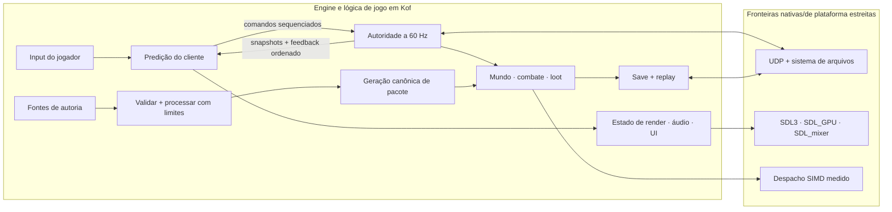

<p align="center">
  
</p>

<p align="center">
  <a href="https://github.com/rufl/KOOKIE/actions/workflows/verify.yml"></a>
  <a href="https://github.com/rufl/KOOKIE/releases"></a>
  
  <a href="../LICENSE"></a>
  
</p>

<p align="center">
  <strong>Uma engine experimental de tiro 3D construída em torno de Kof.</strong><br>
  Combate de boomer shooter, estrutura de ARPG, multiplayer autoritativo e um
  pipeline de conteúdo que falha de forma segura—sem uma engine genérica por
  trás.
</p>

<p align="center">
  <a href="#início-rápido">Início rápido</a> ·
  <a href="#a-forma-da-engine">Arquitetura</a> ·
  <a href="https://github.com/rufl/KOOKIE/releases">Releases dogfood</a> ·
  <a href="docs/RUNNING_AND_PACKAGING.md">Build e pacotes</a> ·
  <a href="../README.md">English</a>
</p>

> **Experimental, de propósito.** O KOOKIE é um laboratório de engine, não um
> jogo pronto nem uma engine genérica. As afirmações abaixo são limitadas às
> sondas, ao hardware e às cargas que produziram suas evidências.

## Comece aqui

| Se você quer… | Vá para |
|---|---|
| Executar a verificação autoritativa atual | [Início rápido](#início-rápido) |
| Baixar o artefato Linux público mais recente | [Releases](https://github.com/rufl/KOOKIE/releases) |
| Experimentar o lobby e a tela de jogadores atuais | [Lobby multiplayer e tela de placar](#lobby-multiplayer-e-tela-de-placar) |
| Avaliar a prontidão da demo jogável Windows/Linux | [Prontidão da release demo](docs/DEMO_RELEASE.md) |
| Entender as fronteiras | [Arquitetura](docs/ARCHITECTURE.md) |
| Gerar builds, pacotes ou papéis de qualificação | [Execução e empacotamento](docs/RUNNING_AND_PACKAGING.md) |
| Ver as evidências e o trabalho aberto | [Plano da engine](docs/ENGINE_PLAN.md) e [backlog G0](docs/G0_BACKLOG.md) |
| Alterar o projeto | [Como contribuir](CONTRIBUTING.md) |

## Por que isto existe

A maioria das engines otimiza para aplicação ampla. O KOOKIE otimiza para
fronteiras de autoridade inspecionáveis e afirmações reproduzíveis.

Decisões portáteis da engine, do jogo e das ferramentas ficam em Kof. C cuida
de fronteiras de plataforma estreitas e explícitas: SDL3/SDL_GPU, SDL_mixer,
UDP, durabilidade no sistema de arquivos e despacho SIMD medido. Uma
funcionalidade não é chamada de pronta só porque existe uma classe ou um menu;
ela precisa de um caminho executável e de um limite de prova declarado.

O resultado é intencionalmente opinativo:

- o servidor decide combate, loot, progressão e persistência;
- clientes predizem movimento seguro para apresentação e depois reconciliam;
- fontes atravessam validação limitada e canonicalização antes do runtime;
- estado, pacotes, saves e ofertas de compatibilidade inválidos falham de forma
  segura;
- artefatos de release vinculam procedência de fonte e toolchain com
  assinaturas.

## Início rápido

### Jogar o pacote publicado

O arquivo dogfood Linux assinado já contém o jogo Kof nativo, SDL3, SDL_mixer
e seu launcher. Executar o jogo empacotado não exige nem o toolchain Kof nem
Python:

1. Baixe [`0.1.0-dogfood.34`](https://github.com/rufl/KOOKIE/releases/tag/0.1.0-dogfood.34).
2. Valide `SHA256SUMS` e as assinaturas destacadas conforme
   [Execução e empacotamento](docs/RUNNING_AND_PACKAGING.md#executar-o-dogfood-linux-publicado-atualmente).
3. Extraia o arquivo e execute:

```bash
./kookie
```

A release pública atual é somente Linux. Ainda não existe um arquivo de demo
Windows atual publicado; o pacote Windows usará `kookie.exe` e também será
autossuficiente.

### Executar a qualificação a partir da fonte

Instale [Kof 0.5.0-beta](https://github.com/KofLang/Kof4j) para o entrypoint
de fonte:

```bash
git clone https://github.com/rufl/KOOKIE.git
cd KOOKIE
kof run src/main.kf --target native
```

O próprio `kof run` não exige Python. Python 3 é exigido atualmente pelos
scripts de verificação, empacotamento, validação de evidências e rendezvous,
como `scripts/verify.sh`, `scripts/package_kookie.sh` e
`scripts/kookie_rendezvous.py`.

Execute o caminho focado de gameplay/replay:

```bash
bash scripts/verify_interactions.sh
```

Execute as sondas focadas do gameplay local, lobby multiplayer e tela de
placar:

```bash
bash scripts/verify_goose_game.sh
bash scripts/verify_multiplayer_ui.sh
```

Execute as sondas não gráficas de expansão G6:

```bash
bash scripts/verify_g6_runtime.sh
```

Builds de pacotes de apresentação também exigem SDL 3.4.16, SDL_mixer 3.2.4
e `glslc`. Os comandos exatos de pacote, kooker, Windows e qualificação entre
hosts estão em [Execução e empacotamento](docs/RUNNING_AND_PACKAGING.md).

Um launcher auto-instalável e autoatualizável ainda não foi publicado. Ele deve
ser um produto separado de bootstrap de desenvolvedor/jogador: o pacote do
jogo precisa permanecer autossuficiente, enquanto a instalação do Kof e as
atualizações dos canais stable/beta/alpha/canary devem usar manifestos
assinados, artefatos fixados e rollback atômico.

## Lobby multiplayer e tela de placar

A tela de multiplayer mantida pelo Kof usa um contrato pequeno e inspecionável:
admissão fixa de dois jogadores, fases host/join/waiting/connected/ready/failed,
identidade de sala/nome, contagem de peers, ping e erros de transporte visíveis.
Não é um navegador de master server. O gameplay só abre quando os dois peers
conectados selecionam `READY`.

Durante o gameplay, `Tab` alterna uma tela determinística de jogadores com nome,
status, score, vida, eliminações/mortes e ping. O host publica um snapshot com
checksum; clientes validam a mensagem inteira, rejeitam sequência obsoleta ou
duplicada e ordenam empates por score, eliminações, mortes e ID estável. `--`
significa que o RTT ainda não foi medido.

## Estado atual da demo e da release

O artefato público mais recente é
[`0.1.0-dogfood.34`](https://github.com/rufl/KOOKIE/releases/tag/0.1.0-dogfood.34):
uma apresentação SDL assinada para Linux x86-64, construída a partir do commit
`4fdc25d7ed377c72cdcb7cf0f4ed35ea992cc947`. Ele antecede o caminho atual de
apresentação, netcode em passo fixo, lobby/tela de placar multiplayer, a
qualificação PE/SDL Windows e os gates atuais da CI. É dogfood de apresentação,
não o pacote atual de demo
jogável.

A árvore de fontes atual contém uma fatia limitada voltada ao jogador:

- `Play` inicia o encounter autoritativo local servidor listen/cliente, aceita
  teclado/mouse, executa três bots gansos e reinicia ao sair e entrar novamente
  em `Play`.
- `Multiplayer > Host/Join` admite o segundo jogador pelo lobby Kof-first,
  exige `READY` dos dois peers conectados e publica o placar determinístico por
  `Tab`, com jogador, status, score, vida, K/D e ping.
- A sessão usa bundles de input em passo fixo com ACKs de snapshot/input,
  fixação do peer autenticado, janela limitada de rewind de hitscan de 12 ticks,
  interpolação remota de seis ticks e métricas de correção da predição. O
  caminho WAN continua sendo IPv4/UDP direto best-effort, não um protocolo
  compatível com QUIC nem um relay de produção.

Revisões autoritativas no mesmo tick são ordenadas pela sequência de estado:
uma sequência nova substitui a amostra mais recente para diagnósticos de ciclo
de vida ou comando obsoleto, enquanto ticks e sequências antigos continuam
rejeitados. Restaurar um checkpoint de replay inicia uma nova época do histórico
de rewind antes de retomar o avanço em passo fixo.

O lote de qualificação de 2026-10-02 passou o gate de pacote de apresentação
Linux assinado/package-smoke com um prefixo temporário fixado de SDL_mixer 3.2.4
e o gate de artefato de apresentação PE/SDL Windows assinado com MinGW
SDL3/SDL_mixer e DXC fixados. Essas verificações comprovam integridade e
ligação do artefato, não gameplay interativo no hardware alvo.

A árvore limpa determinística e o workflow aprovado de release pareada estão
implementados; ainda falta atualizar o pacote público e reter a evidência
específica de cada alvo.

| Alvo | Estado atual da fonte/evidência | Evidência restante para release |
|---|---|---|
| Linux x86-64 | A apresentação nativa contém gameplay local, host/join de dois jogadores, gate explícito de prontidão, estado autoritativo de bots/jogadores, nomes, corações e lobby/placar limitados. As sondas JVM/nativas focadas e o gate de pacote assinado/package-smoke passam. | Executar o builder pareado de árvore limpa, verificar o arquivo extraído fora do checkout e executar smoke isolado de iniciar/jogar/reiniciar/sair em uma GPU suportada e host Linux novo. |
| Windows x86-64 | Os gates de empacotamento PE/SDL nativo e reprodutibilidade incluem o probe Kof de apresentação atual, SDL3/SDL_mixer e produtos SPIR-V/DXIL. O gate de artefato assinado passa com dependências de build fixadas; não há evidência de hardware Windows nativo retida. | Executar o builder pareado de árvore limpa, verificar o ZIP extraído fora do checkout e concluir smoke nativo Windows de input/áudio/GPU/driver. |

O checklist detalhado de aceitação, os bloqueios e o escopo futuro não bloqueante
estão em [Prontidão da release demo](docs/DEMO_RELEASE.md).

## O que funciona hoje

| Área | Caminho limitado implementado |
|---|---|
| **Autoridade e rede** | Sessões servidor/cliente a 60 Hz, admissão de dois clientes, handshake autenticado de compatibilidade, bundles de input em passo fixo com redundância e ACK limitados, endpoints de peer fixados, rewind de hitscan de 12 ticks, interpolação remota de seis ticks, métricas de predição/reconciliação, reconexão e rejeição de replay/adulteração; rendezvous WAN limitado por IPv4 direto com hole punching UDP best-effort; lobby Kof-first e placar de dois jogadores com checksum |
| **Fatia voltada ao jogador** | `Play` executa o encounter autoritativo limitado; Host/Join adiciona gate explícito de dois jogadores; `Tab` mostra a tela de jogadores autoritativa do host. Smoke de pacote novo e evidência de hardware nativo continuam gates de release. |
| **Sistemas de tiro e ARPG** | Combate hitscan/projétil/shotgun, papéis de inimigos, loot determinístico, inventário, equipamento, skills, status, chefes, recompensas e progressão exatamente uma vez |
| **Mundo e apresentação** | Arena 3D criada com inclinações, degraus e salas empilhadas; colisão cápsula/triângulo; portas, segredos e saídas; HUD semântico; instancing por SDL_GPU; ganho/pan posicional por SDL_mixer |
| **Conteúdo e ferramentas de criação** | Entrada limitada de GLB, Dust3D, Aseprite, VOX, brushes estilo Quake, Blockbench, PNG e WAV; produtos canônicos; validação `.kpkg`; edições transacionais no Kutter; hierarquia, transformações e registro de assets persistentes no Kutter |
| **Persistência e release** | Replay com checksum, migrações de schema, publicação de save durável contra crash, pacotes assinados de árvore limpa, fechamento de dependências e smoke fora do checkout |
| **Alvos de runtime** | Linux x86-64 nativo autoritativo; gameplay Kof PE nativo no Windows ligado ao shell SDL3/SDL_mixer; apresentação Kof PE nativa com SDL_GPU e produtos SPIR-V/DXIL; pacote separado de compatibilidade Kof JVM para Windows; compilador Kof determinístico e alcançável para PE/COFF AMD64 |

## A forma da engine



Kof toma as decisões. O código nativo cuida de fronteiras explícitas de ABI e
plataforma. A apresentação consome estado autoritativo; ela não concede dano,
loot nem progressão. Veja [Arquitetura](docs/ARCHITECTURE.md) para os contratos
completos.

## Evidência de engenharia

Estes números descrevem cargas exatas de qualificação retidas—não afirmações
gerais de desempenho.

| Evidência | Resultado registrado | Limite |
|---|---:|---|
| Sessão autoritativa | 60 Hz, host + dois clientes | Qualificação de processos na mesma máquina; G4 também passou em três namespaces de rede Linux isolados |
| Soak da simulação G5 | p95 de **3,202 ms/tick**; RSS dentro de **128 KiB** após aquecimento | 30 minutos numa estação Linux x86-64; 64 inimigos, 256 projéteis, 512 itens, 24 luzes, 64 efeitos |
| Cena de referência SDL_GPU | **984** instâncias de triângulo em hardware em **um draw**; p95 de envio **0,645 ms** | 600 frames em 1920×1080 nos gráficos Intel Arrow Lake registrados |
| Sonda SIMD de buffer Kof | lote de 64 MiB: escalar **233,350 ms**, AVX2 **1,074 ms** | ABI/carga de redução exata; não é afirmação de ganho em todo o gameplay |
| Cadeia de release | Arquivo, manifesto e conjunto de checksums assinados com Ed25519 | Exige árvore limpa, fonte Kof fixada e digest verificado da distribuição |

## Conteúdo que atravessa a fronteira

O kooker aceita subconjuntos documentados em vez de alegar compatibilidade
geral com os formatos:

`GLB` · `Dust3D` · `Aseprite` · `VOX` · `MAP` · `Blockbench` · `PNG` · `WAV`

Ele emite geometria/colisão canônica limitada, imagens/atlas RGBA8, personagens
`KCHR`, áudio PCM16 e checksums prontos para pacote. Os produtos são reabertos
e validados antes da publicação atômica; imports que falham mantêm a geração
anterior ativa.

```bash
scripts/kooker.sh cook blockbench character.bbmodel character.kchar
scripts/kooker.sh cook png texture.png texture.rgba.png
scripts/kooker.sh cook wav effect.wav effect.pcm16.wav
```

Os limites fazem parte do contrato, não são omissões temporárias da
documentação. Veja
[Reforço adicional da entrada](docs/ARCHITECTURE.md#reforço-adicional-da-entrada)
para o trabalho de produção ainda aberto.

## Limites honestos

- A evidência de transporte inclui o endpoint autenticado limitado por IPv4 direto
  e um canal determinístico de janela/retry; não há bundle recente retido de
  qualificação em três máquinas físicas, nem alegação de NAT traversal, relay,
  confidencialidade ou resistência a DDoS.
- Linux x86-64 continua sendo o alvo autoritativo de gameplay Kof nativo. O
  Windows agora tem gameplay Kof PE nativo qualificado no shell SDL e no pacote
  de apresentação SDL_GPU; o pacote JVM separado é somente de compatibilidade.
  O smoke opcional em Wine isolado depende do ambiente e do alvo/GPU.
- Importadores suportam perfis pequenos e explícitos, não arquivos arbitrários
  de cada formato nomeado.
- Reload ao vivo cobre produtos validados de cena/render, não código Kof,
  shaders, plugins de editor ou streaming ilimitado.
- Autoria além do Kutter persistente limitado, cobertura adicional de SO/GPU,
  áudio comprimido/em streaming, HRTF/EFX e uma API geral de extensões em
  sandbox continuam incompletos.

Se uma afirmação não tem teste ou sonda focada, ela não é apresentada como
concluída.

## Mapa do repositório

| Caminho | Propósito |
|---|---|
| [`src/`](../src/) | Lógica de engine, jogo, sessão, conteúdo e UI em Kof |
| [`native/`](../native/) | Adaptadores estreitos de SDL, transporte, persistência e SIMD |
| [`apps/`](../apps/) | Servidor, kooker, benchmark SIMD e ferramentas de plataforma empacotados |
| [`probes/`](../probes/) | Evidência executável focada nas fronteiras de risco |
| [`scripts/`](../scripts/) | Automação de verificação, pacote e qualificação |
| [`docs/`](docs/) | Arquitetura, planos, notas da linguagem e evidência de pesquisa |

## Documentação

- [Arquitetura](docs/ARCHITECTURE.md) — autoridade, fluxo de dados e fronteiras
  do runtime.
- [Plano da engine](docs/ENGINE_PLAN.md) — definições de gates, medições e
  escopo adiado.
- [Execução e empacotamento](docs/RUNNING_AND_PACKAGING.md) — comandos de
  desenvolvimento, release, kooker e qualificação.
- [Notas da linguagem Kof](docs/KOF_LANGUAGE.md) — sintaxe, alvos, FFI e
  descobertas do runtime.
- [Sondas executadas](docs/RESEARCH_PROBES.md) — comandos, resultados e limites
  de prova.
- [Changelog](CHANGELOG.md) — mudanças recentes de comportamento.
- [Memória do projeto](MEMORY.md) — decisões atuais, ressalvas e próxima ação.

A documentação pública também está disponível em
[inglês](../README.md).

## Como contribuir

Leia [CONTRIBUTING.md](CONTRIBUTING.md) antes de mudar dependências, fronteiras
de autoridade ou afirmações de qualificação. Durante o desenvolvimento,
execute a menor verificação focada que comprove a mudança. O gate completo é:

```bash
bash scripts/verify.sh
```

Verificações gráficas devem usar o contrato revisado de display isolado do
repositório; nunca use o desktop ativo nem um monitor físico. Descobertas
sensíveis de segurança pertencem ao
[canal privado](SECURITY.md), não a uma issue pública.

## Licença e procedência

O KOOKIE usa a [licença MIT](../LICENSE). As dependências nativas distribuídas
são SDL 3.4.16 e SDL_mixer 3.2.4 sob a licença zlib. O perfil JVM opcional para
Windows inclui um runtime OpenJDK fixado por SHA-256 sob licenças próprias e
preserva `runtime/legal` e `runtime/NOTICE`. Fontes e fronteiras exatas estão em
[THIRD_PARTY_NOTICES.txt](../THIRD_PARTY_NOTICES.txt).

O compilador Kof continua como ferramenta externa de build e não é distribuído.
Somente o perfil JVM explícito para Windows inclui Java; sua procedência registra
fornecedor, versão e digest do arquivo do runtime.