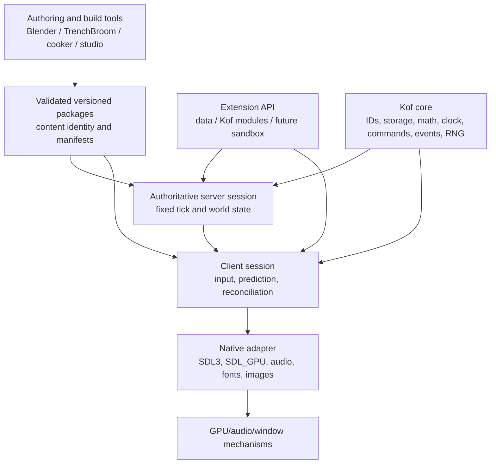
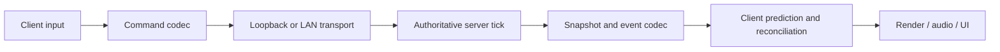

# Arquitetura do projeto KOOKIE

Status: **arquitetura proposta; a implementação ainda não foi iniciada**.

Este documento é a autoridade de arquitetura no nível do projeto. Os experimentos
detalhados de aceitação permanecem em [ENGINE_PLAN.md](ENGINE_PLAN.md). As decisões
de reutilização permanecem em [MONOREPO_REUSE.md](MONOREPO_REUSE.md).

## 1. Limite do produto

KOOKIE é um motor FPS 3D verdadeiro, com prioridade para multiplayer e orientado
a conteúdo, compatível com os conjuntos de regras de boomer-shooter,
looter-shooter e ARPG-FPS sobre uma única base de simulação e conteúdo.

Toda partida é uma sessão de rede:

- O modo para um jogador é um servidor local em modo listen mais um cliente local por meio de transporte de loopback serializado.
- O modo LAN é um servidor host mais clientes locais e remotos.
- O modo dedicado é um servidor sem interface mais clientes remotos.

Não existe um caminho privilegiado de simulação offline.

## 2. Decisões arquiteturais

1. **Monólito modular:** um runtime Kof, uma simulação autoritativa, módulos
   estáticos, sem ABI de plugin dinâmica inicialmente.
2. **Autoridade do servidor:** o servidor é responsável pela simulação, persistência,
   RNG, combate, inventário, progressão, geração do mundo e autoridade de extensões.
3. **Propriedade do Kof:** o comportamento de CPU pertencente ao motor permanece em `.kf`.
4. **Fronteira nativa fina:** o código nativo adapta mecanismos de SDL/GPU/áudio/fonte/imagem; não é responsável pela jogabilidade nem pelos algoritmos de cena.
5. **API de extensão estável:** extensões públicas usam IDs versionados, consultas,
   comandos, eventos, registros e instantâneos, em vez de arrays internos.
6. **Dados em primeiro lugar:** pacotes de conteúdo são validados, versionados,
   organizados em namespaces e publicados atomicamente antes da admissão pelo runtime.
7. **Comportamento limitado:** filas, memória, tamanhos de pacotes, contagens de entidades, trabalho de scripts e efeitos de extensões têm limites explícitos e resultados de falha.
8. **Nenhuma autoridade oculta:** renderizador, cliente, editor, áudio e mods não podem
   alterar silenciosamente o estado autoritativo do servidor.

## 3. Modelo de camadas



### Núcleo Kof

Contratos estáveis e com poucas dependências:

- IDs seguros contra geração e armazenamento tipado.
- Núcleos matemáticos e buffers temporários pertencentes ao chamador.
- Relógio fixo e política de ticks.
- Comandos de entrada e eventos de domínio.
- Fluxos determinísticos de RNG.
- Limites, resultados de capacidade e política de estouro.
- Validação de revisão/geração.
- Handles públicos, visões de consulta, buffers de comandos e instantâneos.

O núcleo não importa jogabilidade, renderização, código de UI, código do editor
nem handles nativos.

### Módulos do servidor

O servidor é responsável pelo estado mutável autoritativo:

- `world`: entidades, estado do nível, consultas espaciais e colisão.
- `gameplay`: movimentação, armas, dano, IA, encontros e interações.
- `arpg`: itens, afixos, habilidades, progressão, status e saque.
- `content`: definições, admissão de pacotes, migrações e identidade.
- `session`: admissão, propriedade do tick, replicação, persistência e papéis.
- `extensions`: registros, verificações de capacidade e execução de extensões do servidor.

Os sistemas do servidor leem o estado aprovado, emitem comandos limitados e
confirmam mutações em fases de tick definidas. IDs estáveis e ordenação declarada
desempatam conflitos.

### Módulos do cliente

O cliente não possui nenhum estado autoritativo do jogo. Ele possui:

- Captura de entrada da plataforma.
- Comandos de entrada marcados com o tick.
- Predição local onde explicitamente permitida.
- Aplicação de instantâneos e reconciliação.
- Extração de renderização/áudio/UI.
- Extensões de apresentação exclusivas do cliente.

A predição do cliente nunca decide dano, saque, inventário, progressão ou
persistência do mundo.

### Módulos de apresentação

`render`, `audio`, `animation` e `ui` consomem instantâneos/eventos somente para leitura:

```text
server snapshot/events
        ↓
client prediction/reconciliation
        ↓
render/audio/UI extraction
        ↓
visibility, sorting, batching and pass policy
        ↓
checked native adapter
```

A apresentação não pode gravar em arrays autoritativos nem conceder resultados de jogabilidade.

### Adaptador nativo

A pilha nativa inicial é SDL3 + SDL_GPU, com Vulkan/SPIR-V primeiro. As
bibliotecas opcionais de mecanismos incluem OpenAL Soft, FreeType/HarfBuzz,
SDL3_image e zstd.

O adaptador é responsável por:

- Janela e consulta de eventos.
- Recursos de GPU e submissão.
- Mecanismos de dispositivo/mixagem de áudio.
- Mecanismos de composição/rasterização de fontes.
- Mecanismos de decodificação de imagens.
- Registros verificados de recursos nativos.

O adaptador não é responsável por entidades, colisão, jogabilidade, semântica de
conteúdo, política de renderização ou lógica de salvamento. A travessia nativa
usa escalares verificados, tokens e buffers limitados; nenhum ponteiro Kof bruto
ou callback é retido.

## 4. Modos de runtime



### Servidor local em modo listen

O processo do jogador contém:

```text
server world
client presentation world
loopback transport
```

O transporte ainda codifica e decodifica mensagens limitadas. Ele pode evitar a
latência física de soquetes, mas não pode passar referências do mundo diretamente.

### Host LAN

O host contém um servidor autoritativo e um cliente local. Os pares remotos usam
o mesmo protocolo de cliente. O host não é confiável apenas porque também renderiza
um cliente local; a autoridade permanece na sessão do servidor.### Servidor dedicado

O servidor dedicado não exige recursos gráficos e executa os mesmos módulos de
servidor, admissão de conteúdo, funções de extensão, sistema de salvamento e
código de replicação.

### Contrato de transporte

O protocolo é independente do transporte:

- Canal de controle confiável e ordenado para handshake, admissão, entrada/saída,
  comandos obrigatórios e metadados da sessão.
- Canal não confiável e sequenciado para entrada e snapshots substituíveis.
- Campos explícitos de tick, sequência, confirmação, baseline e revisão de
  conteúdo.
- Tamanho de pacote, trabalho de decodificação, comprimento de fila e quantidade
  de entidades limitados.
- Rejeição de comandos obsoletos, identificadores inválidos, conteúdo
  incompatível e capacidades não suportadas.

A biblioteca de rede de terceiros é selecionada depois da validação do protocolo
e da prova de loopback, não antes.

## 5. Arquitetura de extensões

As extensões têm dois níveis de API:

- APIs privadas de módulos internos, otimizadas para o mecanismo.
- Uma API pública versionada, que deve permanecer estável durante refatorações
  internas.

Camadas de extensão:

### Pacotes de dados

Itens, armas, inimigos, encontros, níveis, materiais, dados de UI,
localização, receitas, progressão e esquemas. Os IDs são
namespaced, por exemplo, `example_mod:plasma_rifle`.

### Módulos Kof confiáveis

Extensões `.kf` compiladas estaticamente podem registrar componentes, sistemas,
IA, geração de mundo, comandos, serializadores, ferramentas de editor,
migrações de salvamento e codecs de rede.

### Comportamento futuro em sandbox

Uma camada posterior de script/bytecode poderá fornecer comportamento sem
recompilação. Ela deve usar os mesmos contratos públicos e orçamentos explícitos
de capacidade. Não deve receber ponteiros brutos, identificadores nativos,
arrays centrais mutáveis, acesso arbitrário ao sistema de arquivos/rede ou
iteração ilimitada.

### Manifesto da extensão

Cada extensão declara:

```text
namespace and identity
engine/API/schema versions
dependencies
capabilities
server/client/shared/data role
content declarations
load order
save migrations
network schemas
provenance and hashes
```

As operações públicas das extensões são:

- Contribuição ao registro.
- Consultas somente leitura ao mundo.
- Buffers de comandos limitados.
- Inscrições em eventos tipados.
- Hooks de sistemas específicos por fase.
- Geração de mundo/encontros com seed.
- Extração de renderização/áudio/UI.
- Migrações de salvamento.
- Registro de codec de rede e esquema de replicação.

Os sistemas são executados na ordem das dependências, depois pela prioridade
declarada e, por fim, pelo ID com namespace. Conflitos e falhas de capacidade
fazem o sistema falhar de forma segura, com diagnósticos.

## 6. Pipeline de conteúdo e assets

```text
editable sources
      ↓
Kof cooker and validators
      ↓
staged package
      ↓
checksums, identity, dependency and schema validation
      ↓
atomic publication
      ↓
server/client admission
```

Os pacotes contêm:

- Magic e versão do formato.
- Versões do mecanismo, das ferramentas e do conteúdo.
- IDs estáveis com namespace.
- Endianness explícito.
- Deslocamentos e comprimentos de chunks limitados.
- Hashes das dependências.
- Convenção de coordenadas/unidades.
- Assinaturas opcionais.
- Recibos de proveniência.

### Fontes de autoria aceitas

O cooker aceita estas fontes de autoria, além do subconjunto canônico de glTF.
Elas são **formatos de entrada offline**, não formatos de runtime:

| Fonte | Contrato de entrada | Resultado canônico |
|---|---|---|
| Dust3D `.ds3` | Preservar o projeto editável como proveniência; validar a geometria exportada, UVs, metadados de esqueleto/animação e transformações finitas | GLB estático ou esquelético, registros de materiais/texturas e fonte de colisão opcional |
| LibreSprite `.ase` / `.aseprite` | Ler quadros, camadas, tags, fatias, paleta e limites dos pixels; rejeitar modos de cor/profundidade não suportados ou normalizá-los explicitamente | Atlas PNG, mais JSON versionado de quadros/tags e definições de animação do Kof |
| MagicaVoxel `.vox` | Ler modelos voxel limitados, dimensões, paleta e chunks de cena suportados; preservar a semântica de paleta/índice e rejeitar chunks não suportados com diagnósticos | Malha/GLB determinístico, registros de paleta/materiais e colisão derivada de voxel opcional |

Regras canônicas de entrada:

- Manter o arquivo-fonte original e o recibo da ferramenta/versão; nunca
  serializar em um pacote o layout de memória privado de um editor.
- Normalizar coordenadas, escala, winding, normais, origem das UVs, taxa de
  quadros e semântica de materiais/cores antes da publicação.
- Usar IDs estáveis de assets com namespace e preservar os mapeamentos da fonte
  para a saída.
- Preferir GLB para intercâmbio 3D e PNG mais metadados para intercâmbio de
  sprites; OBJ/FBX ou outras exportações são entradas de conversão alternativas,
  não contratos de runtime.
- Validar contagens, dimensões, índices, referências de paleta, tamanhos de
  imagem, durações de animação, valores numéricos finitos e memória decodificada
  antes do staging.
- Uma conversão malsucedida ou não suportada mantém o pacote válido anterior.

Dust3D é um projeto externo de autoria licenciado sob MIT. LibreSprite é GPLv2 e
deve permanecer uma ferramenta externa ou uma entrada de formato implementada de
forma independente; não incorpore código do LibreSprite ao KOOKIE. MagicaVoxel é
freeware proprietário; não empacote nem redistribua seu aplicativo. Ler o formato
`.vox` documentado e aceitar arquivos `.vox` fornecidos pelo usuário é algo
separado de empacotar a ferramenta. Registre todos os avisos de origem das
fontes/ferramentas na proveniência do pacote.

O cooker é responsável pela semântica de cenas, colisões, gameplay e pacotes.
Bibliotecas nativas de imagem, fontes e áudio fornecem apenas mecanismos
restritos de decodificação.

A publicação é transacional: preparar, validar, publicar ou manter o pacote
válido anterior. As revisões de geometria, colisão, navegação e replicação devem
ser publicadas juntas.

### Detalhes da entrada derivados do corpus a definir


Os projetos do monorepo sugerem vários contratos que vale a pena fixar antes da
implementação dos parsers:

1. **Recibos de origem:** registrar caminho da fonte, SHA-256, ferramenta/versão, opções,
   hashes das dependências, convenção de coordenadas e hashes das saídas geradas.
   Os recibos identificam bytes e configurações; eles não comprovam a correção
   artística ou de runtime.
2. **Registro canônico de importação:** todo importador emite o mesmo registro
   limitado: identidade da fonte, ID estável do asset, artefatos de saída, avisos,
   limites, dependências, transformação de coordenadas e resultado da validação.
3. **Vínculos estáveis:** preservar IDs de quadros, IDs de camadas/tags, IDs de
   nós/materiais e mapeamentos da fonte para a saída entre renomeações,
   reordenações e reexportações. Nunca vincular gameplay ou animação à posição
   em um array.
4. **Validação de reabertura:** após o cooking, reabrir o GLB gerado, o atlas,
   os metadados e os produtos de colisão por meio dos leitores de runtime. Um
   processo de exportação concluído com sucesso não é prova suficiente.
5. **Conjuntos atômicos de produtos:** malha, materiais, texturas, animação,
   colisão, navegação e metadados de replicação são publicados como uma única
   revisão. Rejeitar a combinação de produtos antigos e novos.
6. **Planos de conversão em modo de simulação:** mostrar arquivos aceitos, IDs
   de saída, avisos, memória decodificada estimada e ferramentas externas antes
   da mutação. A conversão externa é uma etapa explícita de build/ferramenta,
   nunca uma execução oculta em runtime.
7. **Tarefas limitadas:** as importações têm limites de tamanho de entrada,
   memória decodificada, quantidade de saídas, recursão e cancelamento. Falhas
   parciais mantêm diagnósticos por fonte e nunca publicam artefatos incompletos.
8. **Normalização determinística:** a mesma fonte, versão da ferramenta, opções e
   conjunto de dependências produzem a mesma saída canônica ou um diagnóstico
   explícito de não determinismo.
9. **Gerações de cache:** malhas derivadas, atlas, colisão e navegação são
   indexados pela identidade da fonte/dependência/revisão. Os leitores mantêm as
   gerações antigas até que o limite do quadro/sessão as aposente.
10. **Conjunto de fixtures do corpus:** manter fixtures válidos, malformados,
    grandes demais, não suportados e de ida e volta, pequenos, para cada formato
    de entrada. Testar o comportamento semântico, os limites e a rejeição de
    publicações obsoletas, não apenas a aceitação pelo parser.Esses contratos incorporam comportamentos de CHARAMELD, SPRITEFORM, CARVER, ZYLVE,
DINX, ZNAP, ARCGEN, ZFONT e ZWAVE sem importar seus runtimes ou
modelos de propriedade estrangeiros.


## 7. Persistência e replay

Os salvamentos pertencem ao servidor e contêm seções semânticas versionadas:

- Personagem e progressão.
- Instâncias e propriedade de itens.
- Persistência do mundo.
- Estado de missões e encontros.
- Fluxos de RNG explícitos quando necessário.
- Identidades do engine/conteúdo/extensão.

Regras:

- Criar um snapshot em um limite de tick definido.
- Preparar, validar, calcular checksum, descarregar e substituir atomicamente.
- Migrar esquemas, nunca slots ou ponteiros brutos.
- Rejeitar seções obrigatórias mais novas sem destruir o salvamento antigo.
- Salvar os resultados obtidos dos itens, não apenas o estado do RNG.

O replay armazena:

```text
engine/content/extension identities
initial snapshot and seed
tick commands
periodic authoritative checkpoints/state hashes
```

O replay re-simula a partir dos checkpoints. Timestamps de apresentação são insuficientes.

## 8. Estrutura do repositório

```text
engines/KOOKIE/
  docs/
    ARCHITECTURE.md
    ENGINE_PLAN.md
    MONOREPO_REUSE.md
    KOF_LANGUAGE.md
    KOF_EDITOR.md
    ...

  src/
    core/          IDs, storage, math, clock, commands, events, RNG
    platform/      Kof extern declarations and checked wrappers
    session/       server/client roles, admission, snapshots, prediction
    net/           messages, codecs, channels, sequence/ack state
    world/         entities, spatial queries, levels, collision
    gameplay/      movement, weapons, damage, AI, encounters
    arpg/          items, stats, loot, skills, progression
    content/       schemas, validation, packages, migrations
    extensions/    manifests, registries, capabilities, public adapters
    render/        extraction, culling, sorting, batching, passes
    animation/     clips, pose state, interpolation
    audio/         voice policy, spatialization, event mapping
    ui/            HUD, menus, inventory, debug/editor views

  apps/
    player/        integrated server + client or LAN client
    server/        headless dedicated server
    cooker/        package validation and cooking
    studio/        editor and authoring tools
  probes/          focused compiler, ABI and session probes


  samples/         multiplayer sample games and content
  native/          indispensable ABI/library adaptation only
  shaders/         GPU shader sources and generated products
  content/         authored source assets and definitions
```

A coleção atual de código-fonte do Kof significa que estes são, primeiro,
limites lógicos de propriedade. A raiz da aplicação compõe os módulos necessários. Não há um
service locator genérico nem uma ABI pública de plugin dinâmico no estágio inicial.

## 9. Regras de dependência

```text
core
  ↓
content contracts
  ↓
world/collision
  ↓
gameplay
  ↓
arpg

core + read-only snapshots/events
  ├── render
  ├── audio
  ├── animation
  └── ui

content + world queries
  ├── cooker
  ├── editor/studio
  └── extensions

platform/native
  └── mechanisms only
```

Regras obrigatórias:

1. Um único mundo autoritativo do servidor.
2. Nenhum ECS estrangeiro ou segunda autoridade de gameplay.
3. Nenhuma mutação dos arrays autoritativos pelo renderer/cliente/editor.
4. Nenhum ponteiro bruto ou slot de runtime em salvamentos ou pacotes de rede.
5. Nenhum acesso de extensões ao armazenamento privado de componentes.
6. Nenhuma mutação por callback arbitrário durante a iteração da simulação.
7. Todas as mudanças estruturais são confirmadas em limites conhecidos.
8. Toda fila, pool, pacote e extensão tem comportamento de capacidade explícito.
9. Revisões obsoletas e manifestos incompatíveis falham de forma segura.
10. Plugins dinâmicos e scripts de runtime são etapas posteriores, não dependências de G0.

## 10. Etapas de implementação

### G0 — Viabilidade nativa e de sessão

Comprovar as correções do compilador/runtime nativo do Kof, a inicialização do SDL, o adaptador verificado,
o ciclo de vida real de GPU/áudio, o envelope de rede limitado e os codecs de loopback.

### G1 — Base de shooter autoritativo

Implementar IDs, arrays tipados, tick do servidor, comandos do cliente, sessão de loopback,
baselines de snapshot, predição/reconciliação, colisão de cápsula e uma arma
e um inimigo.

### G2 — Fatia de boomer-shooter em LAN

Adicionar transporte LAN, host mais vários clientes, tratamento de entrada/saída/reconexão,
hitscan/projéteis, encontros e recompensas pertencentes ao servidor.

### G3 — Fatia multiplayer de looter/ARPG

Adicionar instâncias de itens, inventário, habilidades, status, progressão, salvamentos autoritativos
e esquemas de extensões replicados.

### G4 — Pipeline de criação e extensões

Adicionar cooker de pacotes, mods de dados, módulos Kof confiáveis, registries, manifestos,
transações do editor e publicação em etapas de conteúdo multiplayer.

### G5 — Escala e lançamento

Adicionar servidor dedicado headless, orçamentos de carga, robustez de migração/replay,
recuperação de reconexão/sessão, empacotamento e avisos.

### G6 — Expansão

Avaliar plataformas adicionais, jobs seguros, transporte WAN, editor mais completo e uma
camada de extensões de runtime em sandbox.

## 11. Não objetivos explícitos

- Um engine de gameplay em C/Zig/Rust oculto atrás do Kof.
- Um único coordenador de runtime gigantesco.
- Um ECS estrangeiro substituindo a propriedade do Kof.
- Plugins nativos dinâmicos como sistema inicial de mods.
- Gameplay offline que contorne a replicação.
- Alegações de lockstep de ponto flutuante entre plataformas.
- Serialização de memória bruta.
- Callbacks de mods ilimitados ou service locators.
- Reutilização de engines ou assets irmãos sem liberação de licença/proveniência.