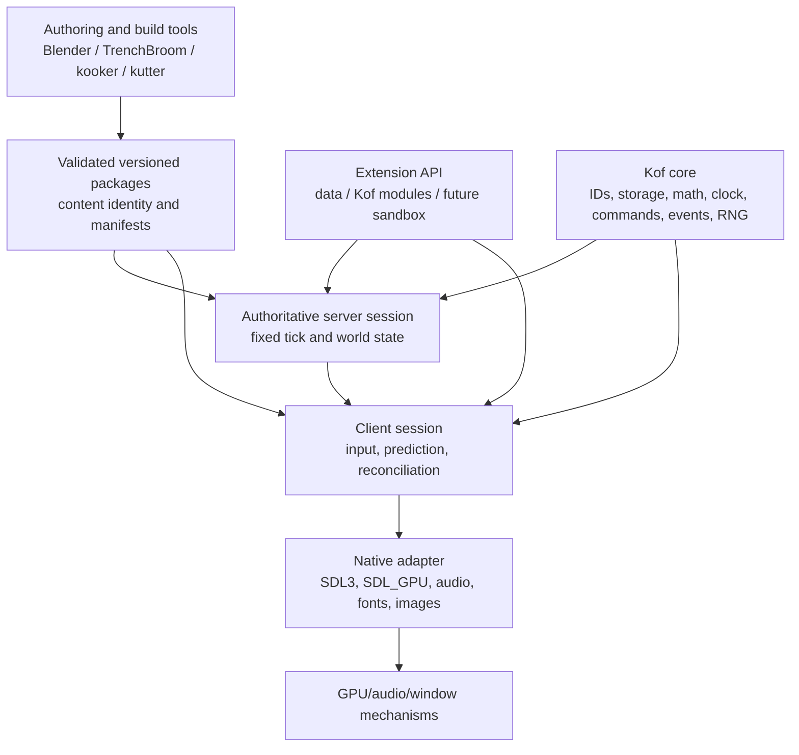
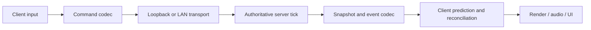

# Arquitetura do projeto KOOKIE

Status: **arquitetura-alvo viva; a implementação limitada de G0–G6 está completa dentro dos limites de qualificação documentados**.


Este documento é a autoridade de arquitetura no nível do projeto. Os
experimentos detalhados de aceitação permanecem em
[ENGINE_PLAN.md](ENGINE_PLAN.md).

## 1. Limite do produto

KOOKIE é um motor FPS 3D verdadeiro, com prioridade para multiplayer e orientado
a conteúdo, compatível com os conjuntos de regras de boomer-shooter,
looter-shooter e ARPG-FPS sobre uma única base de simulação e conteúdo.

Toda partida é uma sessão de rede:

- O modo para um jogador é um servidor local em modo listen mais um cliente local por meio de transporte de loopback serializado.
- O modo LAN é um servidor host mais clientes locais e remotos.
- O modo dedicado é um servidor sem interface mais clientes remotos.

Não existe um caminho privilegiado de simulação offline.

## 2. Decisões arquiteturais

1. **Monólito modular:** um runtime Kof, uma simulação autoritativa, módulos
   estáticos, sem ABI de plugin dinâmica inicialmente.
2. **Autoridade do servidor:** o servidor é responsável pela simulação, persistência,
   RNG, combate, inventário, progressão, geração do mundo e autoridade de extensões.
3. **Propriedade do Kof:** o comportamento de CPU pertencente ao motor permanece em `.kf`.
4. **Fronteira nativa fina:** o código nativo adapta mecanismos de SDL/GPU/áudio/fonte/imagem; não é responsável pela jogabilidade nem pelos algoritmos de cena.
5. **API de extensão estável:** extensões públicas usam IDs versionados, consultas,
   comandos, eventos, registros e instantâneos, em vez de arrays internos.
6. **Dados em primeiro lugar:** pacotes de conteúdo são validados, versionados,
   organizados em namespaces e publicados atomicamente antes da admissão pelo runtime.
7. **Comportamento limitado:** filas, memória, tamanhos de pacotes, contagens de entidades, trabalho de scripts e efeitos de extensões têm limites explícitos e resultados de falha.
8. **Nenhuma autoridade oculta:** renderizador, cliente, editor, áudio e mods não podem
   alterar silenciosamente o estado autoritativo do servidor.

## 3. Modelo de camadas


```mermaid
flowchart TB
    Tools[Authoring and build tools\nBlender / TrenchBroom / kooker / kutter]
    Packages[Validated versioned packages\ncontent identity and manifests]
    Extensions[Extension API\ndata / Kof modules / future sandbox]
    Server[Authoritative server session\nfixed tick and world state]
    Client[Client session\ninput, prediction, reconciliation]
    Core[Kof core\nIDs, storage, math, clock, commands, events, RNG]
    Native[Native adapter\nSDL3, SDL_GPU, audio, fonts, images]
    GPU[GPU/audio/window mechanisms]

    Tools --> Packages
    Packages --> Server
    Packages --> Client
    Extensions --> Server
    Extensions --> Client
    Core --> Server
    Core --> Client
    Server --> Client
    Client --> Native
    Native --> GPU
```

### Núcleo Kof

Contratos estáveis e com poucas dependências:

- IDs seguros contra geração e armazenamento tipado.
- Núcleos matemáticos e buffers temporários pertencentes ao chamador.
- Relógio fixo e política de ticks.
- Comandos de entrada e eventos de domínio.
- Fluxos determinísticos de RNG.
- Limites, resultados de capacidade e política de estouro.
- Validação de revisão/geração.
- Handles públicos, visões de consulta, buffers de comandos e instantâneos.

O núcleo não importa jogabilidade, renderização, código de UI, código do editor
nem handles nativos.

### Módulos do servidor

O servidor é responsável pelo estado mutável autoritativo:

- `world`: entidades, estado do nível, consultas espaciais e colisão.
- `gameplay`: movimentação, armas, dano, IA, encontros e interações.
- `arpg`: itens, afixos, habilidades, progressão, status e saque.
- `content`: definições, admissão de pacotes, migrações e identidade.
- `session`: admissão, propriedade do tick, replicação, persistência e papéis.
- `extensions`: registros, verificações de capacidade e execução de extensões do servidor.

Os sistemas do servidor leem o estado aprovado, emitem comandos limitados e
confirmam mutações em fases de tick definidas. IDs estáveis e ordenação declarada
desempatam conflitos.

### Módulos do cliente

O cliente não possui nenhum estado autoritativo do jogo. Ele possui:

- Captura de entrada da plataforma.
- Comandos de entrada marcados com o tick.
- Predição local onde explicitamente permitida.
- Aplicação de instantâneos e reconciliação.
- Extração de renderização/áudio/UI.
- Extensões de apresentação exclusivas do cliente.

A predição do cliente nunca decide dano, saque, inventário, progressão ou
persistência do mundo.

### Módulos de apresentação

`render`, `audio`, `animation` e `ui` consomem instantâneos/eventos somente para leitura:

```text
server snapshot/events
        ↓
client prediction/reconciliation
        ↓
render/audio/UI extraction
        ↓
visibility, sorting, batching and pass policy
        ↓
checked native adapter
```

A apresentação não pode gravar em arrays autoritativos nem conceder resultados de jogabilidade.

O slice limitado implementado segue essa fronteira: resoluções autoritativas de
combate emitem registros `ImpactPresentationEvent` monotônicos; lotes ordenados
de feedback levam cada evento confirmado às filas limitadas de HUD/áudio do cliente.
O HUD deriva geometria limitada por tick de acerto/eliminação/dano, além de
estados de conexão, encounter, ameaça/derrota de elite/chefe,
inventário/equipamento/skill/loot G3 e publicação de criador G4 distinguíveis
pela forma. Overflow de apresentação é diagnosticado e nunca desfaz estado
autoritativo. Portas 3D criadas adicionam um cuboide de 36 vértices entre a
arena de 78 e o HUD de 372; a cena fixa atual tem 486 vértices. O Kof deriva
atenuação por distância e pan estéreo antes do envio PCM para streams
independentes de efeitos e música no SDL_mixer.


### Adaptador nativo

A pilha nativa é SDL3 + SDL_GPU + SDL_mixer 3.2.4, com Vulkan/SPIR-V primeiro.
Bibliotecas futuras distribuídas devem continuar permissivas; os candidatos
atuais incluem FreeType/HarfBuzz, SDL3_image e zstd.

O adaptador é responsável por:

- Janela e consulta de eventos.
- Recursos de GPU e submissão.
- Mecanismos de dispositivo/mixagem de áudio.
- Mecanismos de composição/rasterização de fontes.
- Mecanismos de decodificação de imagens.
- Registros verificados de recursos nativos.

O adaptador não é responsável por entidades, colisão, jogabilidade, semântica de
conteúdo, política de renderização ou lógica de salvamento. A travessia nativa
usa escalares verificados, tokens e buffers limitados; nenhum ponteiro Kof bruto
ou callback é retido.

A fronteira do compilador Windows consome IR otimizada do frontend Kof exato e
fixado e emite C11 determinístico e COFF AMD64. Builds standalone emitem PE de
console; builds de biblioteca exportam `kookie_kof_gameplay_main` para um host
nativo. O subconjunto alcançável admitido cobre as classes do gameplay/
apresentação atual, objetos heap, arrays, valores integral/Boolean/String,
fluxo de controle, impressão, indexação de String e FFI SDL integral. IR de
ponto flutuante, exceções capturáveis e concorrência ainda falham de forma
fechada com `PE001`. O C gerado é um intermediário do compilador, não uma
segunda autoridade de engine escrita à mão.

## 4. Modos de runtime


```mermaid
flowchart LR
    Input[Client input] --> Encode[Command codec]
    Encode --> Transport[Loopback or LAN transport]
    Transport --> Server[Authoritative server tick]
    Server --> Snapshot[Snapshot and event codec]
    Snapshot --> Predict[Client prediction and reconciliation]
    Predict --> Present[Render / audio / UI]
```

### Servidor local em modo listen

O processo do jogador contém:

```text
server world
client presentation world
loopback transport
```

O transporte ainda codifica e decodifica mensagens limitadas. Ele pode evitar a
latência física de soquetes, mas não pode passar referências do mundo diretamente.

### Host LAN

O host contém um servidor autoritativo e um cliente local. Os pares remotos usam
o mesmo protocolo de cliente. O host não é confiável apenas porque também
renderiza um cliente local; a autoridade permanece na sessão do servidor.

### Servidor dedicado

O servidor dedicado não exige recursos gráficos e executa os mesmos módulos de
servidor, admissão de conteúdo, funções de extensão, sistema de salvamento e
código de replicação.

### Contrato de transporte

O protocolo é independente do transporte:

- Canal de controle confiável e ordenado para handshake, admissão, entrada/saída,
  comandos obrigatórios e metadados da sessão.
- Canal de input em passo fixo sobre UDP autenticado: até três inputs ordenados
  são repetidos, o último snapshot é confirmado e o host retorna um ACK de
  input; snapshots autoritativos mais novos substituem ticks antigos, enquanto
  uma sequência de estado maior pode substituir a amostra mais recente no mesmo tick.
- Campos explícitos de tick, sequência, confirmação, baseline e revisão de
  conteúdo.
- Tamanho de pacote, trabalho de decodificação, comprimento de fila e quantidade
  de entidades limitados.
- Rejeição de comandos obsoletos, identificadores inválidos, conteúdo
  incompatível e capacidades não suportadas.

O protocolo G2 implementado usa comandos fixos de 11 palavras e estado de
jogador/progressão com 20 palavras específico por destinatário. Uma mensagem
dinâmica do encounter com checksum usa `20 + 8N` palavras para até 32 inimigos;
cada entrada contém ID estável, papel, estado, alvo, vida e posição 3D inteira.
Uma mensagem ordenada de feedback usa `6 + 11F` palavras para até 16 eventos de
impacto. A entrada envia baselines válidos no tick zero de gameplay, feedback e
encounter. O decode valida a mensagem inteira antes da mutação, admite geração
antes da sequência, rejeita estado obsoleto ou com lacunas e não trata
apresentação descartada como falha do estado autoritativo.

Antes de snapshots ou comandos de gameplay, cada endpoint remoto troca um
handshake limitado de controle de compatibilidade. A oferta do cliente tem 18
palavras: framing, sequência, a identidade exata
`BoundedContentCompatibility` de 13 palavras e checksum. A resposta do servidor
tem 7 palavras com estado aceito/rejeitado, diagnóstico, sequência e checksum da
identidade do servidor. Decode, checksum, sequência e comparação exata da
identidade terminam antes de o endpoint ficar pronto; divergências e ofertas
malformadas recebem resposta de rejeição e não podem avançar o gameplay. O
framing SipHash do transporte fornece autenticação e integridade dos pacotes. O
checksum de compatibilidade identifica conteúdo e detecta erros; ele não é um
autenticador criptográfico. Processos de papéis JVM e nativos usam o mesmo
caminho wire; a evidência G4 atual não retém uma execução recente em três
máquinas.


O lobby de apresentação e a tela de jogadores permanecem na mesma fronteira
Kof-first. `Play` local usa o caminho autoritativo servidor listen/cliente;
partidas remotas usam `Host/Join` e nunca ignoram a admissão da sessão.
`MatchLobbyState` possui ciclo fixo de dois jogadores, identidade de sala/nome,
flags ready/unready, contagem de peers, ping e erros de transporte explícitos.
O gameplay não pode entrar até que os jogadores local e remoto conectados
definam seus flags de prontidão.
`MatchScoreboardState` possui linhas fixas e ordenação determinística; seu wire
limitado carrega schema, tick, sequência, identidade, flags, vida, estatísticas
de score, ping e tick de último avistamento antes de aceitar um checksum da
mensagem inteira. Somente o host publica o score de gameplay; o cliente rejeita
snapshots obsoletos, duplicados, malformados, acima da capacidade ou adulterados
antes de substituir suas linhas. `Tab` é apenas um evento de borda nativo;
visibilidade e geometria da tela continuam sendo estado Kof. Ping `--` é medida
desconhecida, nunca latência inventada. Esta fatia não promete master server,
relay ou RTT medido.

A biblioteca de rede de terceiros é selecionada depois da validação do protocolo
e da prova de loopback, não antes.

## 5. Arquitetura de extensões

As extensões têm dois níveis de API:

- APIs privadas de módulos internos, otimizadas para o mecanismo.
- Uma API pública versionada, que deve permanecer estável durante refatorações
  internas.

Camadas de extensão:

### Pacotes de dados

Itens, armas, inimigos, encontros, níveis, materiais, dados de UI,
localização, receitas, progressão e esquemas. Os IDs são
namespaced, por exemplo, `example_mod:plasma_rifle`.

### Módulos Kof confiáveis

Extensões `.kf` compiladas estaticamente podem registrar componentes, sistemas,
IA, geração de mundo, comandos, serializadores, ferramentas de editor,
migrações de salvamento e codecs de rede.

### Comportamento KofScript em sandbox

`BoundedKofScriptProgram` é a camada de bytecode sem recompilação. Seu artefato
canônico declara uma assinatura de evento de domínio, fluxo somente para a
frente, orçamentos de pilha/instruções/saídas e máscaras explícitas de
capacidade para comandos/eventos. O verificador rejeita loops, código
inalcançável, profundidades de pilha inconsistentes em branches, saídas não
declaradas e corrupção de checksum antes da execução. A VM pré-alocada rejeita
overflow aritmético e descarta toda saída preparada quando há falha.

Os programas recebem apenas campos inteiros copiados do evento e só podem
emitir registros públicos versionados admitidos por suas máscaras. Comandos de
moeda atravessam o mesmo gate atômico da sessão autoritativa usado pelos hooks
confiáveis. Não há opcodes para ponteiros brutos, handles nativos, arrays
centrais mutáveis, filesystem/rede nem iteração ilimitada. O builder KofScript
offline emite o artefato; runtimes Kof JVM e nativo reabrem e executam palavras
idênticas.

### Manifesto da extensão

Cada extensão declara:

```text
namespace and identity
engine/API/schema versions
dependencies
capabilities
server/client/shared/data role
content declarations
load order
save migrations
network schemas
provenance and hashes
```

As operações públicas das extensões são:

- Contribuição ao registro.
- Consultas somente leitura ao mundo.
- Buffers de comandos limitados.
- Inscrições em eventos tipados.
- Hooks de sistemas específicos por fase.
- Geração de mundo/encontros com seed.
- Extração de renderização/áudio/UI.
- Migrações de salvamento.
- Registro de codec de rede e esquema de replicação.

Os sistemas são executados na ordem das dependências, depois pela prioridade
declarada e, por fim, pelo ID com namespace. Conflitos e falhas de capacidade
fazem o sistema falhar de forma segura, com diagnósticos.

O caminho G4 de módulos confiáveis não expõe callbacks arbitrários.
`BoundedTrustedModuleRegistry` vincula no máximo 32 IDs de hooks compilados
estaticamente e suas versões binárias a contribuições declaradas no manifesto,
tipos de eventos, fases e orçamentos de comandos/eventos.
`BoundedTrustedHookRuntime` aceita somente módulo selado cujos checksums de
extensão/módulo correspondam a uma geração publicada, despacha eventos tipados
de início de sessão, conexão de jogador, derrota de inimigo, coleta de loot e
publicação do editor em ordem monotônica de sequência/fase, e verifica toda
capacidade por hook/global antes da emissão. Implementações estáticas
registradas produzem eventos limitados de auditoria/boas-vindas/recompensa/
publicação; a sessão autoritativa consome o comando de concessão de moeda
exatamente uma vez após validar overflow agregado. Hooks nunca recebem acesso
mutável ao núcleo.

## 6. Pipeline de conteúdo e assets

```text
editable sources
      ↓
Kof kooker and validators
      ↓
staged package
      ↓
checksums, identity, dependency and schema validation
      ↓
atomic publication
      ↓
server/client admission
```

Os pacotes contêm:

- Magic e versão do formato.
- Versões do mecanismo, das ferramentas e do conteúdo.
- IDs estáveis com namespace.
- Endianness explícito.
- Deslocamentos e comprimentos de chunks limitados.
- Hashes das dependências.
- Convenção de coordenadas/unidades.
- Assinaturas opcionais.
- Recibos de proveniência.

### Fontes de autoria aceitas

O kooker de arquivos aceita estas fontes de autoria, além do subconjunto
canônico de glTF indexado. Elas são **formatos de entrada offline**, não
formatos de runtime:

| Fonte | Contrato limitado implementado | Resultado canônico |
|---|---|---|
| Dust3D `.ds3` + `.glb` exportado | Validar estruturalmente um arquivo sem ZIP64/criptografia de até 1 MiB com `model.json` limitado; validar uma primitiva indexada de triângulos, accessor UV float VEC2 e atributos pareados de skin com pesos float quando houver skin | Wire canônico de geometria, colisão criada e checksums de fonte/material |
| LibreSprite `.ase` / `.aseprite` | Até 8 MiB, 64 frames/layers, frames RGBA 256×256 e 262.144 pixels de atlas; cels raw/zlib, layers normais, tags, slices, paleta, user data e perfil de cor; rejeitar chunks/modos desconhecidos | Atlas PNG RGBA determinístico, durações dos frames e checksum de metadados |
| MagicaVoxel `.vox` | Versões 150–200, até oito modelos e 20 voxels; `PACK`, `SIZE`, `XYZI`, `RGBA`, `nTRN`, `nGRP`, `nSHP` e `LAYR`; rejeitar qualquer outro chunk | Geometria/colisão determinística de cubos, checksum da paleta e contagem de nós da cena |
| `.map` no estilo Quake | Subconjunto ASCII em grade inteira de entidade/propriedade e planos de brushes convexos; até 8.192 tokens, 64 entidades, 512 propriedades, 16 planos por brush e 256 vértices/triângulos de saída | Geometria/colisão canônica triangulada, mais checksums de entidade, material e visibilidade |
| Blockbench `.bbmodel` | JSON do formato 5.0 exato, de até 1 MiB; outliner de personagem somente com cubos, com no máximo 64 ossos UUID, 128 cuboides, 32 clips, 512 keyframes e profundidade 16; valores de posição/rotação/escala limitados a ±100.000 e normalizados em milésimos, clips de até 600 segundos e interpolação `linear`/`step`; rejeitar UUIDs duplicados/desconhecidos, Molang, efeitos e interpolação incompatível | `KCHR` v1 little-endian reaberto, com cuboides em ponto fixo, hierarquia/clips vinculados por UUID e checksums de fonte/personagem/ossos/animação/canônico; pixels de textura e dados UV/material por face ficam fora do `KCHR` v1 |
| PNG `.png` | Até 1 MiB, 64 chunks e 256×256 pixels; tipos de cor 0/2/3/4/6 de 8 bits sem entrelaçamento, `IDAT` consecutivo, zlib, filtros 0–4, `PLTE`, `tRNS` e `tEXt` validado; verificar CRC/Adler e rejeitar Adam7, APNG, outras profundidades e qualquer outro chunk auxiliar/desconhecido | PNG RGBA8 determinístico, sem entrelaçamento e reaberto, mais checksums de fonte, pixels decodificados, metadados e canônico |
| WAVE PCM `.wav` | RIFF/WAVE de até 2 MiB e 32 chunks; `fmt ` PCM exato de 16 bytes com tag `0x0001`, mono/estéreo, 8–96 kHz, amostras unsigned de 8 bits ou signed little-endian de 16 bits, no máximo 30 segundos e 1 MiB de PCM canônico; admitir e remover `JUNK`, `PAD ` e `LIST/INFO`, exigir padding ímpar zero e rejeitar RF64, extensível/float/comprimido, cues, loops e qualquer outro chunk | WAVE PCM16 determinístico e reaberto, com checksums de fonte, amostras normalizadas, metadados removidos e canônico |

Regras canônicas de entrada:

- Manter o arquivo-fonte original e o recibo da ferramenta/versão; nunca
  serializar em um pacote o layout de memória privado de um editor.
- Normalizar coordenadas, escala, winding, normais, origem das UVs, taxa de
  quadros e semântica de materiais/cores antes da publicação.
- Usar IDs estáveis de assets com namespace e preservar os mapeamentos da fonte
  para a saída.
- Preferir GLB para intercâmbio 3D e PNG mais metadados para intercâmbio de
  sprites; OBJ/FBX ou outras exportações são entradas de conversão alternativas,
  não contratos de runtime.
- Validar contagens, dimensões, índices, referências de paleta, tamanhos de
  imagem, durações de animação, valores numéricos finitos e memória decodificada
  antes do staging.
- Uma conversão malsucedida ou não suportada mantém o pacote válido anterior.

Dust3D é um projeto externo de autoria licenciado sob MIT. LibreSprite é GPLv2 e
deve permanecer uma ferramenta externa ou uma entrada de formato implementada
de forma independente; não incorpore código do LibreSprite ao KOOKIE.
MagicaVoxel é freeware proprietário; não empacote nem redistribua seu
aplicativo. Ler o formato `.vox` documentado e aceitar arquivos `.vox`
fornecidos pelo usuário é algo separado de empacotar a ferramenta. [O
aplicativo Blockbench é GPL-3.0-or-later](https://github.com/JannisX11/blockbench/blob/e2ede0809ee6bc91f374ac7e00d34cffbdf86a14/LICENSE.MD);
o KOOKIE não o inclui nem copia sua implementação. O leitor independente tem
como alvo o
[codec de projeto 5.0 upstream](https://github.com/JannisX11/blockbench/blob/e2ede0809ee6bc91f374ac7e00d34cffbdf86a14/js/formats/bbmodel.js)
e aceita somente arquivos-fonte fornecidos pelo usuário. Registre todos os
avisos de fonte/ferramenta na proveniência do pacote.

O leitor independente segue a
[Recomendação PNG Terceira Edição do W3C](https://www.w3.org/TR/png-3/) para o
subconjunto estático admitido. Ele preserva os valores das amostras sem
conversão de gamma; perfis de cor e outros chunks auxiliares semânticos são
rejeitados, portanto a política de materiais deve declarar explicitamente a
interpretação do espaço de cor no runtime.

O leitor WAVE implementa de forma independente a tag PCM limitada `0x0001`
registrada pela [RFC 2361](https://www.rfc-editor.org/rfc/rfc2361) e o modelo de
carregamento RIFF/WAVE documentado por
[SDL_LoadWAV](https://wiki.libsdl.org/SDL3/SDL_LoadWAV). Ele emite PCM16
estático; streaming e decodificação comprimida ficam fora deste contrato.

O kooker é responsável pela semântica de cenas, colisões, gameplay e pacotes.
Bibliotecas nativas de imagem, fontes e áudio fornecem apenas mecanismos
restritos de decodificação.

A publicação é transacional: preparar, validar, publicar ou manter o pacote
válido anterior. As revisões de geometria, colisão, navegação e replicação devem
ser publicadas juntas.

`scripts/kooker.sh` expõe `cook`, `package`, `inspect-package` e
`validate-package` por uma CLI JVM de desenvolvimento. Os arquivos Linux também
contêm um runner `kooker` nativo para o mesmo caminho Kof de `cook`; as
operações de pacote continuam exclusivas da JVM. O envelope `.kpkg` armazena
cabeçalhos little-endian explícitos, caminhos lógicos limitados e payloads de
chunks.
Seu leitor rejeita traversal, caminhos/IDs duplicados, sobreposição, bytes fora
de alcance, hash divergente e registros corrompidos.
`BoundedExternalPackageRuntime` monta candidatos de pacote e registros de
extensões/definições/hooks e só os troca após validação completa; reload com
falha preserva pacote, registros e geração ativos.

`BoundedKutterWorkspace` aplica transações verificadas por revisão de
mundo/entidade/arma/loot a um conjunto atômico de produtos de
geometria/colisão/navegação/render. A tela Kutter expõe toggles de inspeção,
mutações pelo console, play-in-editor e histórico limitado de 16 operações de
undo/redo. O adaptador nativo mantém a cena CPU ativa separada enquanto prepara
uma candidata, aguarda a conclusão síncrona da fence de upload antes de
reutilizar o buffer GPU persistente e então ativa no limite de frame. O
coordenador Kof mantém identidades de gerações referenciadas e só permite
aposentadoria depois que referências e fence são liberadas. Esse contrato cobre
produtos validados de cena; não é hot reload arbitrário de código, shader ou
plugin.

### Reforço adicional da entrada

Os parsers implementados já fornecem checksums limitados de fonte/resultado,
produtos canônicos, validação de reabertura de GLB/PNG/WAV, diagnósticos
determinísticos e publicação atômica. Alvos restantes para robustez de produção
incluem:

1. **Recibos de origem:** registrar caminho da fonte, SHA-256, ferramenta/versão, opções,
   hashes das dependências, convenção de coordenadas e hashes das saídas geradas.
   Os recibos identificam bytes e configurações; eles não comprovam a correção
   artística ou de runtime.
2. **Registro canônico de importação:** todo importador emite o mesmo registro
   limitado: identidade da fonte, ID estável do asset, artefatos de saída, avisos,
   limites, dependências, transformação de coordenadas e resultado da validação.
3. **Vínculos estáveis:** preservar IDs de quadros, IDs de camadas/tags, IDs de
   nós/materiais e mapeamentos da fonte para a saída entre renomeações,
   reordenações e reexportações. Nunca vincular gameplay ou animação à posição
   em um array.
4. **Validação de reabertura:** após o cooking, reabrir GLB, `KCHR`, PNG/WAV,
   metadados de atlas e produtos de colisão gerados pelos leitores de runtime.
   Um processo de exportação concluído com sucesso não é prova suficiente.
5. **Conjuntos atômicos de produtos:** malha, materiais, texturas, animação,
   colisão, navegação e metadados de replicação são publicados como uma única
   revisão. Rejeitar a combinação de produtos antigos e novos.
6. **Planos de conversão em modo de simulação:** mostrar arquivos aceitos, IDs
   de saída, avisos, memória decodificada estimada e ferramentas externas antes
   da mutação. A conversão externa é uma etapa explícita de build/ferramenta,
   nunca uma execução oculta em runtime.
7. **Tarefas limitadas:** as importações têm limites de tamanho de entrada,
   memória decodificada, quantidade de saídas, recursão e cancelamento. Falhas
   parciais mantêm diagnósticos por fonte e nunca publicam artefatos incompletos.
8. **Normalização determinística:** a mesma fonte, versão da ferramenta, opções e
   conjunto de dependências produzem a mesma saída canônica ou um diagnóstico
   explícito de não determinismo.
9. **Gerações de cache:** malhas derivadas, atlas, colisão e navegação são
   indexados pela identidade da fonte/dependência/revisão. Os leitores mantêm as
   gerações antigas até que o limite do quadro/sessão as aposente.
10. **Conjunto de fixtures do corpus:** manter fixtures válidos, malformados,
    grandes demais, não suportados e de ida e volta, pequenos, para cada formato
    de entrada. Testar o comportamento semântico, os limites e a rejeição de
    publicações obsoletas, não apenas a aceitação pelo parser.

Esses contratos são expressos como comportamento pertencente ao KOOKIE, com
limites explícitos e testáveis, sem outro modelo de responsabilidade de runtime.


## 7. Persistência e replay

Os salvamentos pertencem ao servidor e contêm seções semânticas versionadas:

- Personagem e progressão.
- Instâncias e propriedade de itens.
- Persistência do mundo.
- Estado de missões e encontros.
- Fluxos de RNG explícitos quando necessário.
- Identidades do engine/conteúdo/extensão.

Regras:

- Criar um snapshot em um limite de tick definido.
- Preparar, validar, calcular checksum, descarregar e substituir atomicamente.
- Migrar esquemas, nunca slots ou ponteiros brutos.
- Rejeitar seções obrigatórias mais novas sem destruir o salvamento antigo.
- Salvar os resultados obtidos dos itens, não apenas o estado do RNG.

O replay armazena:

```text
engine/content/extension identities
initial snapshot and seed
tick commands
periodic authoritative checkpoints/state hashes
```

O replay re-simula a partir dos checkpoints. Timestamps de apresentação são insuficientes.

Restaurar um checkpoint anterior invalida as amostras de rewind do futuro
descartado; o próximo tick fixo inicia uma nova época do histórico de rewind.

## 8. Estrutura do repositório

```text
engines/KOOKIE/
  docs/
    ARCHITECTURE.md
    ENGINE_PLAN.md
    KOF_LANGUAGE.md
    KOF_EDITOR.md
    ...

  src/
    core/          IDs, storage, math, clock, commands, events, RNG
    platform/      Kof extern declarations and checked wrappers
    session/       server/client roles, admission, snapshots, prediction
    net/           messages, codecs, channels, sequence/ack state
    world/         entities, spatial queries, levels, collision
    gameplay/      movement, weapons, damage, AI, encounters
    arpg/          items, stats, loot, skills, progression
    content/       schemas, validation, packages, migrations
    extensions/    manifests, registries, capabilities, public adapters
    render/        extraction, culling, sorting, batching, passes
    animation/     clips, pose state, interpolation
    audio/         voice policy, spatialization, event mapping
    ui/            HUD, menus, inventory, debug/editor views

  apps/
    player/        integrated server + client or LAN client
    server/        headless dedicated server
    kooker/        package validation and cooking
    kutter/        Kutter authoring tools
  probes/          focused compiler, ABI and session probes


  samples/         multiplayer sample games and content
  native/          indispensable ABI/library adaptation only
  shaders/         GPU shader sources and generated products
  content/         authored source assets and definitions
```

A coleção atual de código-fonte do Kof significa que estes são, primeiro,
limites lógicos de propriedade. A raiz da aplicação compõe os módulos necessários. Não há um
service locator genérico nem uma ABI pública de plugin dinâmico no estágio inicial.

## 9. Regras de dependência

```text
core
  ↓
content contracts
  ↓
world/collision
  ↓
gameplay
  ↓
arpg

core + read-only snapshots/events
  ├── render
  ├── audio
  ├── animation
  └── ui

content + world queries
  ├── kooker
  ├── editor/kutter
  └── extensions

platform/native
  └── mechanisms only
```

Regras obrigatórias:

1. Um único mundo autoritativo do servidor.
2. Nenhum ECS estrangeiro ou segunda autoridade de gameplay.
3. Nenhuma mutação dos arrays autoritativos pelo renderer/cliente/editor.
4. Nenhum ponteiro bruto ou slot de runtime em salvamentos ou pacotes de rede.
5. Nenhum acesso de extensões ao armazenamento privado de componentes.
6. Nenhuma mutação por callback arbitrário durante a iteração da simulação.
7. Todas as mudanças estruturais são confirmadas em limites conhecidos.
8. Toda fila, pool, pacote e extensão tem comportamento de capacidade explícito.
9. Revisões obsoletas e manifestos incompatíveis falham de forma segura.
10. Plugins dinâmicos e scripts de runtime são etapas posteriores, não dependências de G0.

## 10. Etapas de implementação

### G0 — Viabilidade nativa e de sessão

Comprovar as correções do compilador/runtime nativo do Kof, a inicialização do SDL, o adaptador verificado,
o ciclo de vida real de GPU/áudio, o envelope de rede limitado e os codecs de loopback.

### G1 — Base de shooter autoritativo

Foram implementados IDs/arrays de componentes, tick autoritativo a 60 Hz,
comandos do cliente, admissão loopback de dois clientes, baselines de snapshot,
predição/reconciliação observável, contato cápsula/BVH de triângulos, uma
arma/inimigo, câmera e HUD semântico de vida/munição/foco/encounter. A arena
criada, os dados compartilhados de colisão e o staging SDL_GPU fixo fecham G1;
escala/soak sustentado permanece em G5.

### G2 — Fatia de boomer-shooter em LAN

Implementado: o transporte autenticado limitado executa host mais dois clientes
com movimento, inimigos contínuos hitscan/projétil/shotgun, dano/morte/recompensa
autoritativos, ciclo de vida e progressão do nível. Baselines de entrada por
destinatário, recuperação de reconexão com geração primeiro,
predição/reconciliação do cliente, colisão/geometria visual 3D das portas,
recuperação ordenada de feedback e espacialização estéreo pertencente ao Kof
completam o contrato G2.


### G3 — Fatia multiplayer de looter/ARPG

Implementado: instâncias de itens, inventário/equipamento, habilidades, status,
progressão, saves autoritativos por schema e estado replicado por destinatário.
`BoundedExtensionRegistry` sela manifestos versionados, dependências,
capacidades e contribuições com namespace, ordenação determinística por
carga/prioridade, diagnósticos de capacidade/conflito e checksums imutáveis.
`BoundedEnemyDefinitionRegistry` sela regras completas de combate,
comportamento, loot, progressão e moeda para elites/chefes; a sessão
autoritativa instancia o ator e todos os contratos de recompensa atomicamente a
partir dessas definições.

### G4 — Pipeline de criação e extensões

Gate limitado implementado: arquivos externos de pacote, manifestos de
extensão, implementações estáticas de hooks confiáveis, definições de inimigos
e produtos alinhados de geometria/colisão/navegação/replicação compartilham uma
identidade de compatibilidade verificada por revisão. Eventos tipados de
domínio, a entrada documentada de GLB/Dust3D/Aseprite/VOX/brush, a CLI de
arquivos, reload de pacote externo, workspace Kutter transacional, reload GPU
no limite de frame protegido por fence e transporte de oferta/resposta de
compatibilidade executam nos caminhos JVM/nativo aceitos. O handshake passou
com host e dois clientes em namespaces de rede Linux separados e pilhas IPv4
distintas. Transações obsoletas, inválidas ou incompatíveis preservam a geração
ativa. O exemplo multiplayer orientado por definições executa o hook publicado
de recompensa de elite após a morte autoritativa e aplica seu comando
exatamente uma vez. Compatibilidade geral de formatos, reload arbitrário de
código, editor de produção e qualificação recente em três máquinas físicas
ficam fora deste gate.

### G5 — Escala e lançamento

O gate Linux limitado concluído usa os mesmos módulos de passo fixo, colisão
criada por autoria, inimigos, projéteis e loot no servidor sem gráficos. A cena
de referência contém 192 vértices, 64 triângulos, 64 inimigos,
256 projéteis móveis, 512 itens, 24 luzes dinâmicas e 64 efeitos. Os orçamentos
móveis de IA/projéteis/itens continuam 16/64/128.

A amostra nativa focada mediu p50/p95/p99/máximo de simulação em
1,518/1,623/1,717/1,757 ms. Uma execução ritmada de 30 minutos mediu
108.000 ticks após 600 de aquecimento em 2,489/3,202/3,721/23,645 ms; o RSS
ficou em uma faixa de 128 KiB em 181 amostras e a assinatura de recursos
`520690` permaneceu estável. Um host autenticado na mesma máquina mais dois
clientes replicam o estado completo a cada tick, montam quatro chunks de forma
transacional, rejeitam estado obsoleto/adulterado e recuperam o cliente B na
geração 2.

A fronteira SDL_GPU prepara 2.952 atributos de vértice como 984 instâncias de
triângulo em hardware em um draw. No dispositivo Vulkan 26.2.3 Intel Arrow
Lake registrado, 600 frames em 1920×1080 mediram p50/p95/p99/máximo de envio em
0,304/0,645/0,845/1,089 ms. O readback 320×240 retido tem SHA-256
`20b37c94927b04689071200346f1e98f3498ce6408697bae697535773f15f5d4`.

Publicação de save staged durável contra crash, migrações em várias etapas,
replay v3 vinculado à identidade e com checksum, guardas contra rollback na
reconexão e pacotes de árvore limpa assinados com Ed25519 encerram o contrato
de robustez de release. G5 está completo para essa carga Linux x86-64 limitada.
Transporte na mesma máquina, um alvo de hardware registrado e populações fixas
não comprovam desempenho WAN/em várias máquinas, multiplataforma ou em escala
arbitrária.

### G6 — Expansão

A qualificação Windows atual inclui pacotes PE/SDL reproduzíveis e assinados:
o shell nativo liga o gameplay Kof alcançável ao SDL3/SDL_mixer, e o perfil de
apresentação liga Kof PE nativo ao adaptador SDL_GPU e empacota produtos
SPIR-V/DXIL. O smoke Wine isolado do shell verifica gameplay; o smoke visual da
apresentação permanece dependente de GPU isolada capaz de DRI3.

### G6 — Evolução do netcode

A camada de sessão combina as partes compatíveis de duas referências atuais:

- O [`d_net.h` atual do UZDoom](https://raw.githubusercontent.com/UZDoom/UZDoom/trunk/src/d_net.h)
  e seu [`d_net.cpp`](https://raw.githubusercontent.com/UZDoom/UZDoom/trunk/src/d_net.cpp)
  usam comandos em passo fixo, histórico limitado, ACKs de sequência e
  consistência, retransmissão, medição de latência e correção de predição.
- O [manual oficial de servidor do Hytale](https://support.hytale.com/hc/en-us/articles/45326769420827-Hytale-Server-Manual)
  documenta um servidor autenticado e autoritativo sobre QUIC/UDP. A superfície
  de pacotes tipados/adaptadores está descrita no
  [guia de listeners de pacotes](https://hytalemodding.dev/en/docs/guides/plugin/listening-to-packets).

O KOOKIE aplica o subconjunto portátil sem importar uma dependência QUIC:
o host continua autoritativo; o cliente envia até três inputs ordenados por
passo fixo e o último ACK de snapshot; o host retorna snapshots tipados e ACK
de input; frames obsoletos são rejeitados; e o transporte nativo fixa o
endereço autenticado do peer após a admissão. Interpolação de snapshots e
predição permanecem limitadas e determinísticas. A redundância de input cobre
perdas UDP comuns sem transformar snapshots em um stream bloqueante.

O servidor também retém uma janela histórica limitada de 12 ticks. O alcance
do hitscan é avaliado na posição do rewind derivada da latência confirmada, não
na distância não confiável enviada pelo cliente. A renderização do jogador
remoto usa atraso limitado de interpolação de seis ticks, e a predição expõe
métricas de contagem, média e maior correção.

O envelope UDP autenticado Linux/Windows permanece para preservar a
portabilidade dos pacotes. A separação de canais é inspirada em QUIC, não é
interoperabilidade QUIC. Ainda não há confidencialidade, relay, recuperação de
NAT simétrico ou proteção DDoS de produção.

O lote de qualificação de 2026-10-02 passou o gate de pacote/package-smoke
Linux assinado e o gate de artefato de apresentação PE/SDL nativo Windows
assinado com dependências de build temporariamente fixadas. Esses checks cobrem
somente integridade/ligação do pacote. D1 ainda exige arquivo pareado de árvore
limpa, smoke interativo fora do checkout e evidência de apresentação em
hardware-alvo Linux/Windows; consulte [Prontidão da release demo](DEMO_RELEASE.md).

## 11. Não objetivos explícitos

- Um engine de gameplay em C/Zig/Rust oculto atrás do Kof.
- Um único coordenador de runtime gigantesco.
- Um ECS estrangeiro substituindo a propriedade do Kof.
- Plugins nativos dinâmicos como sistema inicial de mods.
- Gameplay offline que contorne a replicação.
- Alegações de lockstep de ponto flutuante entre plataformas.
- Serialização de memória bruta.
- Callbacks de mods ilimitados ou service locators.
- Importação de código ou assets sem liberação de licença e proveniência.